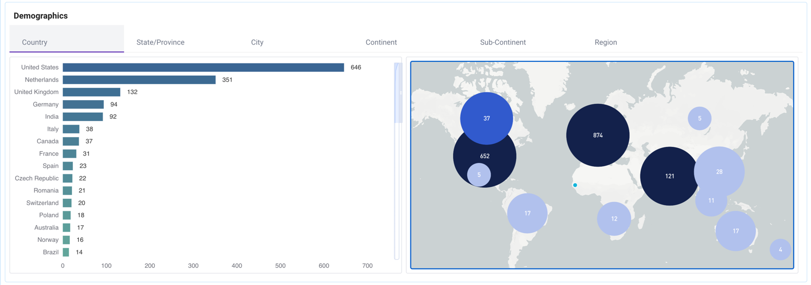
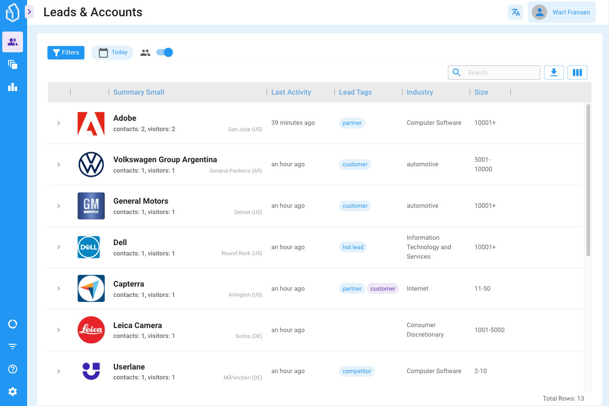

# Changelog

### 01-04-2023

## New trigger and Actions to automate LeadBoard cards moving through your funnel!

We are super excited to announce that we you can now configure LeadBoxer to automatically create new cards and move existing leadboard cards from one stage to another based on all the triggers we support.

<figure><figcaption></figcaption></figure>

This means you can now create a **fully automated visual overview of your Lead Generation efforts!**

See the [Workflow Automation](../fundamentals/elements/workflow-automation.md) documentation to get started and see examples.

## Upload Leads

Now this is something new: You can now Upload other leads and Accounts to LeadBoxer.&#x20;

<figure><figcaption></figcaption></figure>

Why is this useful? 2 answers:

1. Use LeadBoxer and the Lead Management features from the LeadBoard for ALL your leads. for example from offline sources like events, phone enquiries, physical encounters, etc.&#x20;
2. To visualize and get complete insights of your outbound campaigns: Upload all leads that are contacted, put them in a board, and automatically track how they move through your leadboard funnel once they start interacting with your content.

More details and instructions can be found in the [Upload Leads](changelog.md#upload-leads) documentation page.

### 17-03-2023

## Quick Segments

We have added the concept of **Quick Segments.**&#x20;

<figure><figcaption></figcaption></figure>

Quick Segments are pre-defined Segments that allow you to quickly filter your data. Quick Segments are not real Segments, meaning they are basically filters applied to the data in real-time and cannot be altered. You can however duplicate a Quick Segment and modify and save as a 'real' segment.

See the [Quick Segments](changelog.md#quick-segments) documentation to see the details.

## Engagement details

We have added 4 new metrics to the Leads & Accounts view regarding the level of engagement in your content. In other words the number of sessions and events for each lead.

<figure><figcaption></figcaption></figure>

## Improved UTM and marketing campaign tracking & reporting

We improved the way we store and display the values from UTM tags for each Lead. They are now categorised in First \* and Last \* values (eg first Campaign and Last Campaign).

For more details see our documentation on [UTM tracking](../integrations/website/tracking-marketing-campaign-data-utm-tags.md)

### 03-03-2023

## New Tag options

<figure><figcaption></figcaption></figure>

You can now manually add tags from 2 places: from the lead details window, but also from the leads & accounts list.

<figure><figcaption></figcaption></figure>

To read more on Lead Tags, see the [Lead tags documentation](../fundamentals/elements/lead-tags.md) page.

### 24-02-2023

## Workflow Automation update

<figure><figcaption></figcaption></figure>

1. We have added new triggers:&#x20;

* Industry
* Employee count
* Country

Meaning you can now trigger an Action based on the values of the above fields.

2. New Action

* Create a new custom property (field) and populate with UTM campaign data.

This is particularly useful to capture the [UTM tags](../integrations/website/utm-tags-for-google-adwords.md) values for the session where a conversion has happend.&#x20;

See complete [Workflow Automation](../fundamentals/elements/workflow-automation.md) docs for more details

### 08-02-2023

## Easy Export for LinkedIn Matched Audiences

Updated and now located directly in the export /download window.

See the complete [LinkedIn Matched Audience](../fundamentals/elements/import-and-export/linkedin-matched-audiences-export.md) documentation for full details and instructions.

### 17-01-2023

## LeadBoxer 3.0 released&#x20;

A complete new User Interface, Navigation and a rebuilt Leads & Accounts report.

<figure><figcaption></figcaption></figure>

One of the main differences is that the Leads & Accounts are shown in a grid format, allowing for numerous easy customisations such as:

* Turning columns on and off
* Grouping Leads into Accounts
* Re-ordering of columns
* Custom summary columns
* Sorting on any column
* Pinning columns
* Filtering within columns

You can read a full breakdown of the new [Leads & Accounts](../fundamentals/projects.md) section.

## 19-12-2022

This week so far, we fixed an issue with links to LinkedIn not working properly in some cases on the account details panel and actually link to the homepage of an organization if we know it.&#x20;

## 15-12-2022

We added the option to manually create a Card on the LeadBoard, straight from from the Leads view. That sounds complicated but it is not really, just have a look at this screenshot and hopefully it wil make sense:

<figure><figcaption></figcaption></figure>

### 07-12-2022

## New Integration: Active Campaign

We are happy to announce the latest native integration with Marketing Automation and CRM software Active Campaign.&#x20;

You can see the complete details of the integration [here](../integrations/other/active-campaign.md)

### 30-11-2022

## New Enrichment Engine

We enabled our new enrichment Engine based on domain-names for all accounts. Meaning all new leads and contacts that have either an email or domain-name will be enriched using our new Engine.&#x20;

The New engine is our new 'state-of-the-art' API based endpoint. We will release this endpoint to the public in 2023.

### Lead Details & UI improvements

As you may have noticed, many of the new features we have added are based on a new User Interface library with modern design patterns that we are transitioning to.&#x20;

We now have added a new Lead Details View or drill-down, and we are also pleased to announce that we have added animations!&#x20;

To see them in action, go to your LeadBoard and click on one of your cards, and open an associated lead.&#x20;

##

##

## 22-11-2022

### Bug-fixes and small improvements&#x20;

* Improvements to the LeadBoard, including a new 'empty state' screen. So that if you have no LeadBoards, it becomes clear what you can do with this feature.
* Style and content updates for the 'Account details panel', for example we now show the email address for each lead if this is known to LeadBoxer
* Style and content updates for the 'Lead details panel', where we now show first campaign and other UTM tag values.&#x20;

## 14-22-2022

### Workflow automation

We have added a new feature called Workflow Automation, that will allow you to create all sorts of simple or complex tasks.

For example to tag a lead if they visit a certain page.

A complete overview tutorials can be found here:&#x20;


[workflow-automation.md](../fundamentals/elements/workflow-automation.md)


### Bug-fixes and small improvements

* Updated new UI to latest version of React (18), which will add speed/ loading time improvements.
* Fixed a bug that caused duplicate LeadBoard cards imports
* Improved initial importing speed of leads into the Leadboard.

