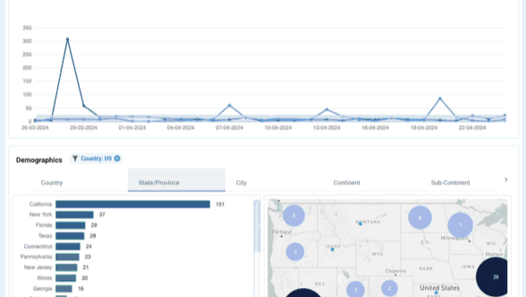
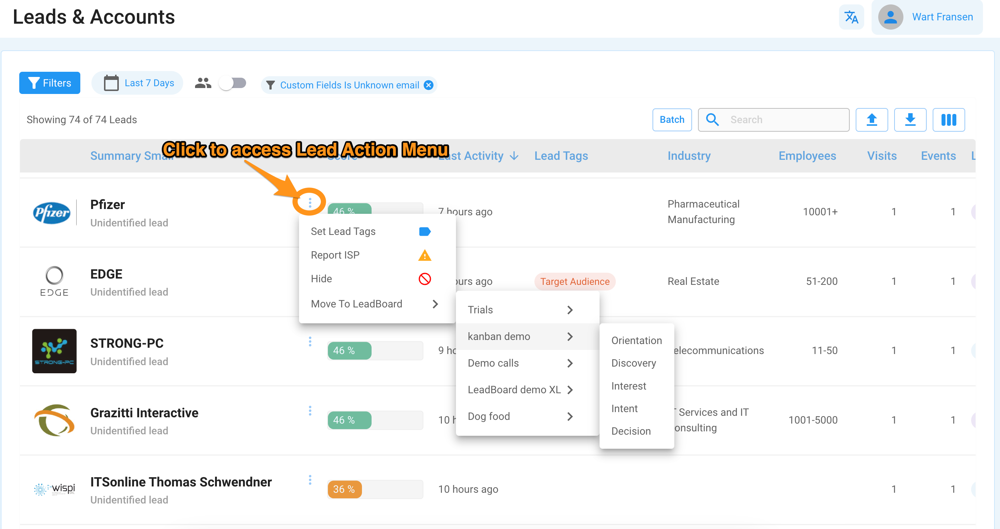
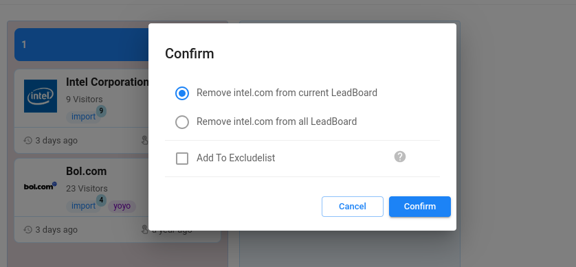
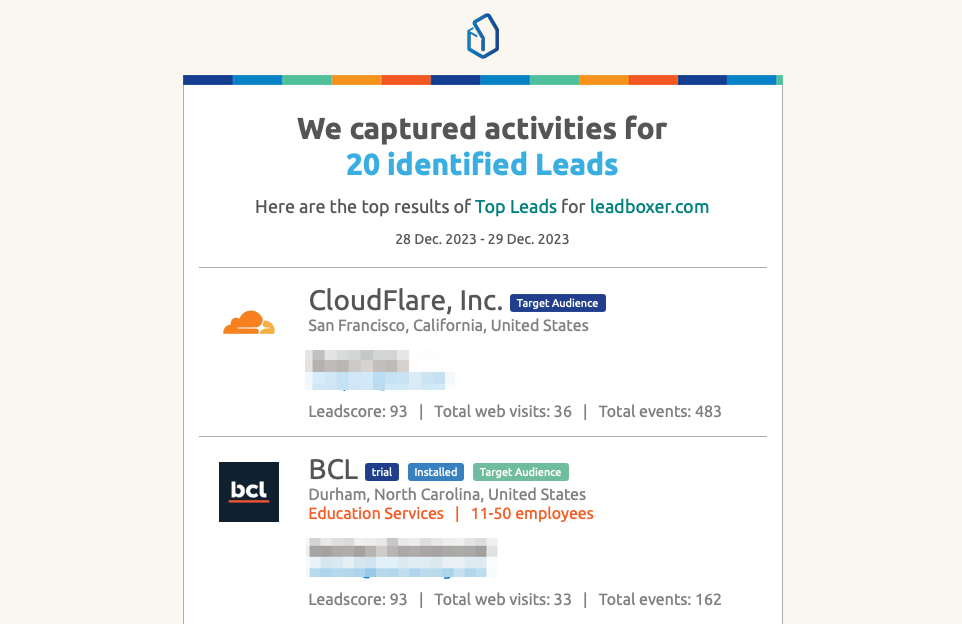
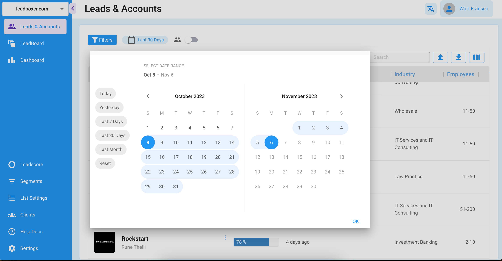
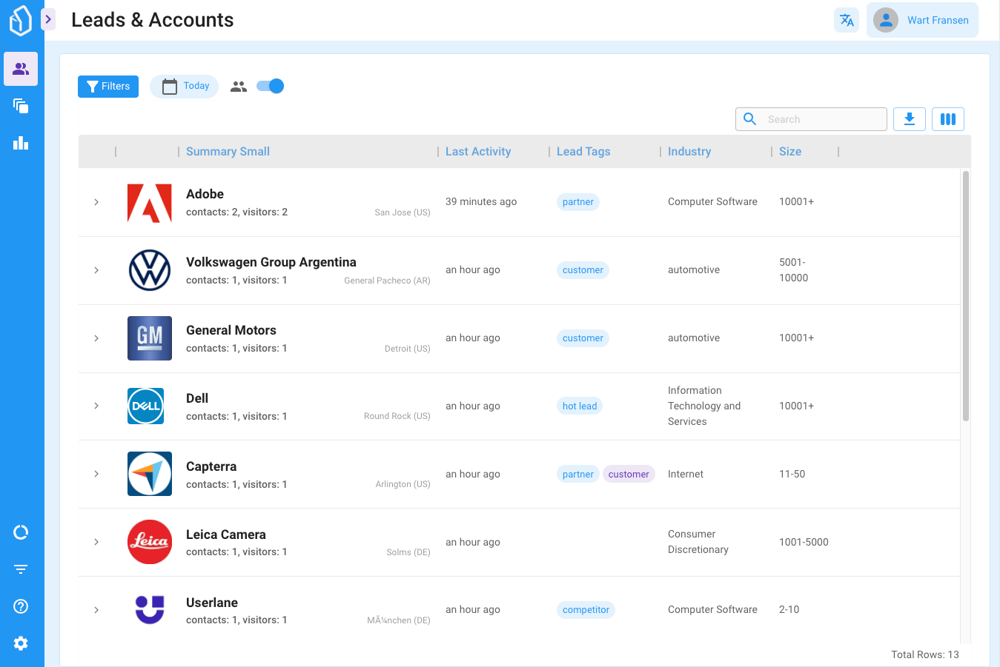

# Changelog

Changes to LeadBoxer App. For changes to the API, see the [API changelog](https://developers.leadboxer.com/changelog).

SEPTEMBER 2026

## LeadBoxer in Claude and other AI assistants (MCP)

You can now use LeadBoxer directly in Claude, Claude Code, Cursor and other AI assistants that support MCP. Ask "Who is behind this IP address?" or "Enrich acme.com" and the assistant looks it up with your LeadBoxer account and credits.

Read more: [MCP server for AI assistants](../developers-and-api/mcp-server.md)

***

JULY 2026

## AI account summaries

Generate a short AI summary of how an account's contacts and visitors interact with your website: who visited, what they looked at and what it suggests. Generate one per account, or summarise all your top accounts at once from Reports.

Read more: [Account summaries](../fundamentals/account-summaries.md)

## Credit overview

A new Credit Overview page (in the profile menu, top right) shows your credit balance, what used your credits and your usage over time.

***

JUNE 2026

## Contact enrichment and contact table

* A new contacts table lists the known contacts linked to an account.
* Contact enrichment adds professional details such as job title and LinkedIn profile to your leads.
* The Leadscore chart has been improved, and the lead list now supports custom date ranges.

***

MAY 2026

## Partial form tracking

LeadBoxer can now capture form fields that a visitor fills in, even when they never press submit. Turn it on per dataset in the dataset settings, next to form tracking.

Read more: [Automatic form tracking](../integrations/website/automatic-form-tracking.md#partial-form-tracking)

## Richer persona profiles

Persona profiles now show more professional details, such as work experience, skills and a short summary.

***

APRIL 2026

## New credit-based pricing

LeadBoxer moved to credit-based pricing: every plan includes monthly credits, and each action (such as identifying a visitor's company or enriching a contact) uses a fixed number of credits. The Billing page was updated with the new plans.

Read more: [LeadBoxer Pricing Explained](../fundamentals/leadboxer-pricing-explained.md) and [LeadBoxer Credits](../fundamentals/elements/leadboxer-credits.md)

***

JANUARY 2026

## Better company identification

We improved how we match IP addresses to companies, with a new IP-to-domain mapping and a scoring model that prefers the most reliable match. You'll see more identified companies and fewer wrong matches.

***

DECEMBER 2025

## LeadBoxer API v1 and Developer Portal

The new LeadBoxer API (v1) lets you read leads, sessions and events, manage tags, segments and datasets, and look up IP addresses and domains, authenticated with your API key. Documentation, guides and an API reference are on the [Developer Portal](https://developers.leadboxer.com/).

Read more: [Developers & API](../developers-and-api/developer-portal.md)

## New lead and account drawers

The lead and account detail panels were redesigned, and company logos are now shown throughout the app. Resetting your password also got a new, simpler flow.

***

NOVEMBER 2025

## New LeadBoard drawer

Opening a card on a LeadBoard now shows the lead's details in a new side panel, so you can work through your board without leaving it.

***

OCTOBER 2025

## Free ICP Generator

Describe your business and the [ICP Generator](https://app.leadboxer.com/icp-generator) creates an Ideal Customer Profile and personas for you, ready to use in LeadBoxer.

***

JULY 2025

## Download reports as PDF

Reports can now be downloaded as a PDF to share with your team or clients.

***

MAY / JUNE 2025

## Inboxer

Inboxer is the new default view of LeadBoxer. It shows the companies engaging with you as cards, so you can spot and act on high-intent accounts quickly.

Read more: [Inboxer](../fundamentals/inboxer.md)

## Persona profiles and email lookup

See the people behind an account with persona profiles, and look up their business email address (uses credits).

## Also new

* Your API key is now available on the Integrations page.
* Mark segments as favourites. Quick filters are now called prebuilt segments.

***

APRIL / MAY 2025

## ICPs & Personas

Define your Ideal Customer Profile (ICP) and personas, and LeadBoxer automatically tags matching accounts and leads. Use these tags in filters, segments and LeadBoards.

Read more: [Goals & Targets](../fundamentals/elements/goals-and-targets.md) and [Definitions & Glossary](../fundamentals/definitions-and-glossary.md#icp-ideal-customer-profile)

***

APRIL 2025

## Improved Login & Signup Flow&#x20;

We’ve updated our login and signup experience to make accessing your account faster and more secure. You can now log in or sign up using your Google (Gmail) or Microsoft accounts.

This update uses secure and industry-standard technologies, including OpenID Connect, OAuth 2.0, and SAML, to ensure your data stays safe.

More login options are coming later this year—stay tuned!

MARCH 2025

## New Feature: Custom Tracking Domains

You can now set up a Custom Tracking Domain (CTD) to monitor email open rates and click-through rates using your own unique tracking URL.

#### Why it matters:

By default, many marketing platforms use shared tracking domains—the same pixel or script shared across thousands of campaigns and clients. This can negatively impact your email deliverability and performance.

With a Custom Tracking Domain, your tracking pixel or link uses your own domain instead of a shared one. This small change can make a big difference:

* Improves email deliverability
* Reduces the chances of being flagged as spam
* Boosts your sender reputation and click-through rates

This is a great upgrade if you’re using marketing automation or email tools and want more control, better performance, and stronger brand alignment.

Here you can read more and learn how to set it up: [Custom Tracking Domains](../integrations/email/marketing-emails/create-tracking-pixel.md)

***

#### DECEMBER 2024

## LeadBoard improvement: Add Leads with Email Only

Allow Leads on leadBoard with only email address

You can now add leads to your LeadBoard using just an email address—no other details required.

This makes it easier to track and manage leads, especially when:

* You’re collecting personal email addresses (e.g., Gmail, Hotmail)
* You’re capturing early interest or lightweight B2B leads
* You want to quickly log potential prospects without full contact data

***

NOVEMBER 2024&#x20;

## Improved option to hide Leads&#x20;

You can now hide leads & accounts based on their Name and/or on Domain.

Especially useful if you have many versions of your name entering into leadboxer, you can now hide them all with one click.

## Improve Acquisition Source logic

We now classify any referrer as the source value. In the past we were only adding this field if there was an UTM value. Now we use also the referring domain as value.

Smaller issues:

* We now show the name of the site in the leads view results counter
* Fixed a bug in the integrations page. we now redirect you back to leads & accounts view if the site contains data.

***

OCTOBER 2024&#x20;

## Data improvements

In october we released a new version of our IP lookup engine. This new version was build from the ground up and improved our Identification rate with 10%

It is also now available as a stand-alone product, in case you are interested.

## New Integrations section

We have completely redesigned the Integrations section and added many new integration options.

See the [Integrations](../integrations/website/README.md) section for more details.

### Small updates & improvements:

* We fixed an issue where a download from the lead list with a [Summary column](../fundamentals/leads-and-accounts/README.md#summary-columns) enabled was causing an issue, the download did not contain company name and is not very useful obviously.
* We now show a maintenance screen if we encounter network downtime

***

#### 14-09-2024

### New field: Landing page title and URL values to Leads & Accounts

The Lead Landing page is simply the very first page the lead lands in his very first visit, and will not be overwritten if the user visits again.&#x20;

See our [Glossary and Definitions](../fundamentals/definitions-and-glossary.md#behaviour-tracking) if you like to learn more

#### 01-09-2024

### Improved detection for Leads from Paid sources.

We have expanded our parameters to better classify Leads that visit your site coming from paid add campaigns. See the [Channel definitions](../integrations/website/tracking-marketing-campaign-data-utm-tags.md) for more details. 

* Improvement for Active Campaign Integration. We have improved the logic to find and sync  existing accounts in AC&#x20;

#### 27-05-2024

## Reports just got better

We improved the reports feature:

* Added drill-down for Top Accounts table
* Added slicing to Industry & company size
* Minor bug fixing bugs

## LeadBoard Owner notifications

You can now get notified if one of the following actions happens on the LeadBoard with a card you own:

* **New LeadCard owner** (email to new owner)
* **LeadCard owner update** (email to old and new owner)
* **LeadCard stage changes** (email to owner)
* **LeadCard deleted/removed** (email to owner)

Notifications are enabled by default and can be disabled on the notifications tab in your profile.

## Account tag improvements

We have added a new [Filter](../fundamentals/elements/filters.md) for Account Tags, and also now support Account Tags in [Workflow Automation](changelog.md#workflow-automation).&#x20;

#### 25-04-2024

## NEW Reports Feature

Hyper-intuitive. The new report feature visualises all your Lead data. Click on any value - a group of leads, a company name, a geographic area or industry, and drill down into the details, all without selecting filters. In one click you can see all people who opened emails, or all companies from a specific industry, and lots more!

<figure><figcaption></figcaption></figure>

Now you can...&#x20;

* See how your audience engagement performs over time
* Visually drill down your data to find opportunities based on geographic data
* Get insights for Industry, company size and industry group
* Learn which companies show the most engagement
* Report on each Campaign or Segment&#x20;

In short: With LeadBoxer you can now get beautiful marketing analytics and use a super easy interface to pinpoint your best leads.&#x20;

[Learn more about Reports → ](../fundamentals/reports.md)

### Are Reports available for all plans?&#x20;

We are making the new Reports feature available for all plans. However, free plans are limited to just 7 days and have fewer features. 
Also, depending on you plan you can create multiple reports in your account.&#x20;

### Coming Soon to Reports&#x20;

* Download: Easily generate and download your reports for colleagues, management, and other stakeholders.&#x20;
* Free delivery: Monthly report delivered to your inbox.

## Single Sign On (SSO) support

We now offer secure authentication for organisations that use Microsoft Entra ID (previously Azure Active Directory).

See the full details here for [Single Sign On](../integrations/other/single-sign-on-sso.md)

## Lead Action dropdown improvements

We added the option to quickly move a lead to a LeadBoard and /or certain stage.

<figure><figcaption></figcaption></figure>

### LeadBoard details added to column selector.

You can now show LeadBoard details as a columns in the Leads & Accounts view. On hover it will also show the stage. When downloaded it will split the baord and stage name into seperate columns.

<figure><figcaption></figcaption></figure>

***

23-02-2024

## Account Tags

We have introduced a new tagging concept, allowing you to tag Accounts, companies or organzations.

Account tags are visible in the Account details pannel, on the LeadBoard cards, and in the Leads & Accounts report as a column.

## New Workflow Action: Set LeadCard Owner

You can now automatically set an owner for Leadboard cards using an action in your workflow automations.

For example, set the owner for Leads from a certain country or region to the responsible person.

### Bonus:  Auto Ownership

When enabled, ownership is auto assigned based on fromEmail address value.

<figure><figcaption></figcaption></figure>

## Improved LeadBoard cards removing features

You can now optionally add an leadcard organisation to the Exclude list, which means it can no longer be added to this LeadBoard going forward, effectively blocking it from appearing again.

<figure><figcaption></figcaption></figure>

#### 02-02-2024

## LeadBoard Filters

We've added new filters to the Leadboard, allowing you to narrow down results so you can focus on the most important or qualified leads.

**Filter on Tags:** include and/or exclude Leadcards with one- or multiple tags.

**Filter on Owner**: Did you know you can assign an owner to a Leadcard? It's now also easier to filter on your- or your colleague's cards.&#x20;

**Filter on Date-range**: set a relatively fixed date-range, so you can focus on new leads. Choose between lead activity and Card activity or card created.

Also: you can Enable the filters by default (make it sticky), so you can continue where you left off yesterday!

<figure><figcaption></figcaption></figure>

## Cross-domain tracking (based on GA)

We now support cross-domain measurement if this is implemented using the Google Analytics GA4 method, see [https://support.google.com/analytics/answer/10071811?hl=en](https://support.google.com/analytics/answer/10071811?hl=en)&#x20;

If you are looking for this feature, please contact us to get this enabled for your account.

***

#### 12-01-2024

## LeadBoard Improvements

#### We now show all individual tags for the organisation or account in a LeadCard details&#x20;

<figure><figcaption></figcaption></figure>

#### We added LeadCard tags to the Account details

<figure><figcaption></figcaption></figure>

#### We added LeadBoard Loading improvements

You will now see various loaders, so that it is clear if we have finished updating the card with the relevant details.

***

#### 03-01-2024

## Set Fixed LeadBoard Direction or flow for Automations

This might seem tedious but is in fact a very useful update. If enabled (default), [Workflow Automation](changelog.md#workflow-automation) actions can only move your LeadBoard cards to the Right direction of your funnel or qualification stages. You can still manually move cards to the Left. You can set or change this setting in the [LeadBoard settings](../fundamentals/leadboard.md).

***

#### 28-12-2023

## Added LeadTags to Daily & weekly HTML notifications

<figure><figcaption></figcaption></figure>

#### 14-12-2023

## Lead Tags in the event / click / behaviour streams

Starting today, we are showing [Lead tags](../fundamentals/elements/lead-tags.md) activity in the lead details drawer / panel so you can see when they were added and by whom.

We will show if the tag was added or removed  manually, through a workflow automation, or even an integration like Mailchimp.

<figure><figcaption></figcaption></figure>

***

#### 07-12-2023

## More permission options for your users & roles&#x20;

You can now enable and disable even more UI elements and features for your users by setting [permissions](changelog.md#roles-and-permissions).&#x20;

This is very useful if you would like to make LeadBoxer less 'advanced' or easier to use.

<figure><figcaption></figcaption></figure>

***

#### 30-11-2023

## Mailchimp Tags Sync

We now automatically import tags from your contacts in Mailchimp and add these to LeadBoxer leads as [Lead Tags](../fundamentals/elements/lead-tags.md). This can be very useful if you label or tag your Mailchimp audiences, for example your customers (client status, or how they entered your mail-list, or the product group or service they are interested in.

<figure><figcaption></figcaption></figure>

***

#### 23-11-2023

## Batch 'add' or 'remove' leads from LeadBoard

We added the option to add or remove a list of leads to your [LeadBoards](../fundamentals/leadboard.md). Meaning you can now create a list of leads using filters or saved segments and upload these leads to a board. Very cool: this works retroactively.

This is extremely useful if you want to build a board with existing data, and do not want to wait for 'new' Leads or behaviour to trigger a [Workflow Automation](../fundamentals/elements/workflow-automation.md).

<figure><figcaption></figcaption></figure>

***

#### 02-11-2023

## New ease-of-use: calendar / date-range selector

We updated and improved the date-range picker, to make it more intuitive and easy to use.

<figure><figcaption></figcaption></figure>

#### 23-10-2023

## Google BigQuery integration

We now support native export of LeadBoxer data into Google BigQuery.

Push all your raw analytics and behavioural data into this powerful storage platform and write custom queries to analyse and visualise your data.&#x20;

This also enables 1 click export to Google Looker Studio!

## Download improvements for Leads & Accounts

* A BIG SHOUT OUT to Charyle Gandee of Fineos here - whose many insightful pieces of feedback have been published here - THANK YOU CHARYLE
* Your downloaded file now has the same column order as what you seen on your screen
* Downloaded files now have a more descriptive title\
  eg: **LeadBoxer-Leads-mysegment-20230901-20230907.csv**
* You can now also modify the name of the file you are downloading
* When selecting Excel format, we now hide the delimiter dropdown&#x20;
* When you start a download, we now automatically close the download modal

## Other

* We fixed several bugs on the LeadBoard
* Speed improvements

#### 25-09-2023

## Improved Referrer details

We improved the referrer data we capture for all website visitors.

Meaning we now have these 4 fields:

* First Referrer (full URL)
* First Referring domain
* Last Referrer full URL)
* Last Referring domain&#x20;

## URL Routing

We have added 'routing' to our application, meaning you can now copy & paste and share the browser URL from the Leadboxer application or link to any Lead, Account or Leadcard. The person opening that link will automatically be taken to the right report, date-range and selected item.

## Redirect

If a user that is trying to access a direct link to a Lead, Account or LeadCard in the LeadBoxer application and this user is not logged in, the user will be first taken to the login page, and after successful login we will now redirect this user to the correct item.

***

#### 15-09-2023

## Search & Sort your leads on the LeadBoard&#x20;

You can now search through all leads on your LeadBoard, and also sort leads based on either the last lead activity or last LeadCard modification date.

You also choose ascending or descending in each column by clicking the little arrows.

To make room for these new features we moved the help button and switch LeadBoard to the top header bar.

<figure><figcaption></figcaption></figure>

***

#### 31-08-2023

## Duplicate LeadBoard

We added the option to duplicate a LeadBoard, also to another dataset.&#x20;

This is particularly useful if you want to create multiple leadboards for multiple sites, sales-teams, products, etc.&#x20;


A duplicate will not duplicate the content aka LeadCards, but only the stages&#x20;


***

#### 25-08-2023

## UI improvements

* Clicking the close /remove icon (x) and removing a filter from a selection or Segment now reloads the Leads & Accounts view.
* We fixed a bug causing scroll-bards to appear in the top dropdown navigation
* You can now horizontally drag and drop columns on the LeadBoard and your browser will automatically scroll to the left or right.

***

#### 18-08-2023

## LeadBoard Ownership

We added the concept of 'ownership' on the LeadBoard, allowing you to assign one of your users to become the 'owner' of a Leadcard.

Easy user Avatars allow you to quickly filter the Board for your or other owners cards.

<figure><figcaption></figcaption></figure>

***

#### 08-08-2023

## Batch Update Leads&#x20;

We have added the option to batch update a list of leads, meaning you can now select multiple leads and perform an action for all the selected leads.&#x20;

For now, you can add or remove Tags in batch mode. In the near future we will add other actions like hide, assign, add to LeadBoard, etc.

***

#### 04-07-2023

## Roles & Permissions

We have implemented a robust roles and permissions system to help you manage user access and control within your organisation.&#x20;

For a complete overview of all documentation see the [Roles & Permissions](changelog.md#roles-and-permissions) page.

## Improved Lead details&#x20;

We changed the location where we show the preview of the organisation to be more prominent. We also added the option to manually link an organisation to a lead. This is useful if you actually know the organisation of an unidentified visitor (eg because you were just on the phone with them) you can aslos 'unlink' an organisation if you want to update or improve the data.

***

#### 20-06-2023

## Multiple Actions in Workflow Automation

You can now set up to 3 actions in the same Automation, for example: Add a tag, move to Stage, and add a custom property.

#### Other updates:

* Segment Overview UI fixes
* Improved Active Campaign integration

***

#### 15-05-2023

## New Trigger: Lead Tags

You can now trigger a [Workflow Automation](changelog.md#workflow-automation), when you manually add or automatically set a lead tag. This is useful if you want to automate your [LeadBoard](../fundamentals/leadboard.md) based on [Lead Tags](../fundamentals/elements/lead-tags.md).

## Support for nested triggers for Workflow Automation

We added the option to create groups of triggers to combine AND and OR conditions in the trigger settings.

***

#### 24-04-2023

## Industry Categories Overhaul

This was a big one, but we did it! We now have implemented the new LinkedIn version 2 Industry Categorisation.

#### From 148 to 421 industries

This means that you will see any of the new 421 industry values in LeadBoxer and they replace the old version that only had 148 industries. The new industries are much more detailed and also make much more sense in many ways.

#### Industry Grouping Filter

We also implemented the new industry groupings, so if you dont want to choose individual industries, you can also select an industry group and filter on multiple industries in one go.

<figure><figcaption></figcaption></figure>

## System events

If you are using one of the new features we added like the LeadBoard and Importing Leads, you might have noticed that we have started adding events in the activity stream for updates that the LeadBoxer system did to this lead or account. We have modified the UI so you can now clearly distinct these from behavioural events, and added some context to the event itself.

<figure><figcaption></figcaption></figure>

***

#### 10-04-2023

## Allow LeadBoard without linked Segment

You can now create a LeadBoard and only manually add leads. You can always add a segment later in the LeadBoard settings page.

## UI / UX improvements

* We added a reset button, so you can now easily reset and remove all filters/ (quick) segments you might have applied.
* We changed the colouring of labels, to easier make a distinction between values.

#### 01-04-2023

## New trigger and Actions to automate movement of LeadBoard cards through your funnel!

We are super excited to announce that you can now configure LeadBoxer to automatically create new cards and move existing leadboard cards from one stage to another based on all the triggers we support.

<figure><figcaption></figcaption></figure>

This means you can now create a **fully automated visual overview of your Lead Generation efforts!**

See the [Workflow Automation](../fundamentals/elements/workflow-automation.md) documentation to get started and see examples.

## Upload Leads

Something new: You can now Upload other leads and Accounts to LeadBoxer.&#x20;

<figure><figcaption></figcaption></figure>

Why is this useful? 2 answers:

1. Use LeadBoxer and the Lead Management features from the LeadBoard for ALL your leads. for example from offline sources like events, phone enquiries, physical encounters, etc.&#x20;
2. To visualise and get complete insights of your outbound campaigns: Upload all leads that are contacted, put them in a board, and automatically track how they move through your leadboard funnel once they start interacting with your content.

More details and instructions can be found in the [Upload Leads](changelog.md#upload-leads) documentation page.

#### 17-03-2023

## Quick Segments

We have added the concept of **Quick Segments.**&#x20;

<figure><figcaption></figcaption></figure>

Quick Segments are pre-defined Segments that allow you to quickly filter your data. Quick Segments are not real Segments, meaning they are basically filters applied to the data in real-time and cannot be altered. You can however duplicate a Quick Segment and modify and save as a 'real' segment.

See the [Quick Segments](changelog.md#quick-segments) documentation to see the details.

## Engagement details

We have added 4 new metrics to the Leads & Accounts view regarding the level of engagement in your content. In other words the number of sessions and events for each lead.

<figure><figcaption></figcaption></figure>

## Improved UTM and marketing campaign tracking & reporting

We improved the way we store and display the values from UTM tags for each Lead. They are now categorised in First \* and Last \* values (eg first Campaign and Last Campaign).

For more details see our documentation on [UTM tracking](../integrations/website/tracking-marketing-campaign-data-utm-tags.md)

#### 03-03-2023

## New Tag options

<figure><figcaption></figcaption></figure>

You can now manually add tags from 2 places: from the lead details window, but also from the leads & accounts list.

<figure><figcaption></figcaption></figure>

To read more on Lead Tags, see the [Lead tags documentation](../fundamentals/elements/lead-tags.md) page.

#### 24-02-2023

## Workflow Automation update

<figure><figcaption></figcaption></figure>

1. We have added new triggers:&#x20;

* Industry
* Employee count
* Country

Meaning you can now trigger an Action based on the values of the above fields.

2. New Action

* Create a new custom property (field) and populate with UTM campaign data.

This is particularly useful to capture the [UTM tags](../integrations/website/utm-tags-for-google-adwords.md) values for the session where a conversion has happend.&#x20;

See complete [Workflow Automation](../fundamentals/elements/workflow-automation.md) docs for more details

#### 08-02-2023

## Easy Export for LinkedIn Matched Audiences

Updated and now located directly in the export /download window.

See the complete [LinkedIn Matched Audience](../fundamentals/elements/import-and-export/linkedin-matched-audiences-export.md) documentation for full details and instructions.

#### 17-01-2023

## LeadBoxer 3.0 released&#x20;

A complete new User Interface, Navigation and a rebuilt Leads & Accounts report.

<figure><figcaption></figcaption></figure>

One of the main differences is that the Leads & Accounts are shown in a grid format, allowing for numerous easy customisations such as:

* Turning columns on and off
* Grouping Leads into Accounts
* Re-ordering of columns
* Custom summary columns
* Sorting on any column
* Pinning columns
* Filtering within columns

You can read a full breakdown of the new [Leads & Accounts](../fundamentals/leads-and-accounts/README.md) section.

#### 19-12-2022

This week so far, we fixed an issue with links to LinkedIn not working properly in some cases on the account details panel and actually link to the homepage of an organisation if we know it.&#x20;

#### 15-12-2022

We added the option to manually create a Card on the LeadBoard, straight from from the Leads view. That sounds complicated but it is not really, just have a look at this screenshot and hopefully it wil make sense:

<figure><figcaption></figcaption></figure>

#### 07-12-2022

## New Integration: Active Campaign

We are happy to announce the latest native integration with Marketing Automation and CRM software Active Campaign.&#x20;

You can see the complete details of the integration [here](../integrations/other/active-campaign.md)

#### 30-11-2022

## New Enrichment Engine

We enabled our new enrichment Engine based on domain-names for all accounts. Meaning all new leads and contacts that have either an email or domain-name will be enriched using our new Engine.&#x20;

The New engine is our new 'state-of-the-art' API based endpoint. We will release this endpoint to the public in 2023.

### Lead Details & UI improvements

As you may have noticed, many of the new features we have added are based on a new User Interface library with modern design patterns that we are transitioning to.&#x20;

We now have added a new Lead Details View or drill-down, and we are also pleased to announce that we have added animations!&#x20;

To see them in action, go to your LeadBoard and click on one of your cards, and open an associated lead.&#x20;

##

##

#### 22-11-2022

### Bug-fixes and small improvements&#x20;

* Improvements to the LeadBoard, including a new 'empty state' screen. So that if you have no LeadBoards, it becomes clear what you can do with this feature.
* Style and content updates for the 'Account details panel', for example we now show the email address for each lead if this is known to LeadBoxer
* Style and content updates for the 'Lead details panel', where we now show first campaign and other UTM tag values.&#x20;

#### 14-22-2022

### Workflow automation

We have added a new feature called Workflow Automation, that will allow you to create all sorts of simple or complex tasks.

For example to tag a lead if they visit a certain page.

A complete overview tutorials can be found here:&#x20;


[workflow-automation.md](../fundamentals/elements/workflow-automation.md)


### Bug-fixes and small improvements

* Updated new UI to latest version of React (18), which will add speed/ loading time improvements.
* Fixed a bug that caused duplicate LeadBoard cards imports
* Improved initial importing speed of leads into the Leadboard.

