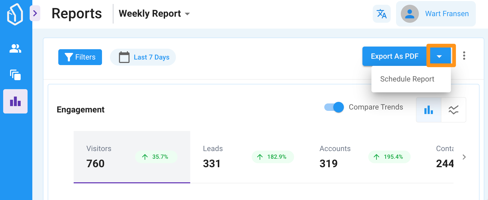

# Changelog

#### 14-12-2023

## Lead Tags in the event / click / behaviour streams

Starting today, we are showing [Lead tags](../fundamentals/elements/lead-tags.md) activity in the lead details drawer / panel so you can see when they were added and by whom.

We will show if the tag was added or removed  manually, through a workflow automation, or even an integration like Mailchimp.

<figure><figcaption></figcaption></figure>

***

#### 07-12-2023

## More permission options for your users & roles&#x20;

You can now enable and disable even more UI elements and features for your users by setting [permissions](changelog.md#roles-and-permissions).&#x20;

This is very useful if you would like to make LeadBoxer less 'advanced' or easier to use.

<figure><figcaption></figcaption></figure>

***

#### 30-11-2023

## Mailchimp Tags Sync

We now automatically import tags from your contacts in Mailchimp and add these to LeadBoxer leads as [Lead Tags](../fundamentals/elements/lead-tags.md). This can be very useful if you label or tag your Mailchimp audiences, for example your customers (client status, or how they entered your mail-list, or the product group or service they are interested in.

<figure><figcaption></figcaption></figure>

***

#### 23-11-2023

## Batch 'add' or 'remove' leads from LeadBoard

We added the option to add or remove a list of leads to your [LeadBoards](../fundamentals/tasks.md). Meaning you can now create a list of leads using filters or saved segments and upload these leads to a board. Very cool: this works retroactively.

This is extremely useful if you want to build a board with existing data, and do not want to wait for 'new' Leads or behaviour to trigger a [Workflow Automation](../fundamentals/elements/workflow-automation.md).

<figure><figcaption></figcaption></figure>

***

#### 02-11-2023

## New ease-of-use: calendar / date-range selector

We updated and improved the date-range picker, to make it more intuitive and easy to use.

<figure><figcaption></figcaption></figure>

#### 23-10-2023

## Google BigQuery integration

We now support native export of LeadBoxer data into Google BigQuery.

Push all your raw analytics and behavioural data into this powerful storage platform and write custom queries to analyse and visualize your data.&#x20;

This also enables 1 click export to Google Looker Studio!

## Download improvements for Leads & Accounts

* Your downloaded file now has the same column order as what you seen on your screen
* Downloaded files now have a more descriptive title\
  eg: **LeadBoxer-Leads-mysegment-20230901-20230907.csv**
* You can now also modify the name of the file you are downloading
* When selecting Excel format, we now hide the delimiter dropdown&#x20;
* When you start a download, we now automatically close the download modal

## Other

* We fixed several bugs on the LeadBoard
* Speed improvements

#### 25-09-2023

## Improved Referrer details

We improved the referrer data we capture for all website visitors.

Meaning we now have these 4 fields:

* First Referrer (full URL)
* First Referring domain
* Last Referrer full URL)
* Last Referring domain&#x20;

## URL Routing

We have added 'routing' to our application, meaning you can now copy & paste and share the browser URL from the Leadboxer application or link to any Lead, Account or Leadcard. The person opening that link will automatically be taken to the right report, date-range and selected item.

## Redirect

If a user that is trying to access a direct link to a Lead, Account or LeadCard in the LeadBoxer application and this user is not logged in, the user will be first taken to the login page, and after successful login we will now redirect this user to the correct item.

***

#### 15-09-2023

## Search & Sort your leads on the LeadBoard&#x20;

You can now search through all leads on your LeadBoard, and also sort leads based on either the last lead activity or last LeadCard modification date.

You also choose ascending or descending in each column by clicking the little arrows.

To make room for these new features we moved the help button and switch LeadBoard to the top header bar.

<figure><figcaption></figcaption></figure>

***

#### 31-08-2023

## Duplicate LeadBoard

We added the option to duplicate a LeadBoard, also to another dataset.&#x20;

This is particularly useful if you want to create multiple leadboards for multiple sites, sales-teams, products, etc.&#x20;


A duplicate will not duplicate the content aka LeadCards, but only the stages&#x20;


***

#### 25-08-2023

## UI improvements

* Clicking the close /remove icon (x) and removing a filter from a selection or Segment now reloads the Leads & Accounts view.
* We fixed a bug causing scroll-bards to appear in the top dropdown navigation
* You can now horizontally drag and drop columns on the LeadBoard and your browser will automatically scroll to the left or right.

***

#### 18-08-2023

## LeadBoard Ownership

We added the concept of 'ownership' on the LeadBoard, allowing you to assign one of your users to become the 'owner' of a Leadcard.

Easy user Avatars allow you to quickly filter the Board for your or other owners cards.

<figure><figcaption></figcaption></figure>

***

#### 08-08-2023

## Batch Update Leads&#x20;

We have added the option to batch update a list of leads, meaning you can now select multiple leads and perform an action for all the selected leads.&#x20;

For now, you can add or remove Tags in batch mode. In the near future we will add other actions like hide, assign, add to LeadBoard, etc.

***

#### 04-07-2023

## Roles & Permissions

We have implemented a robust roles and permissions system to help you manage user access and control within your organization.&#x20;

For a complete overview of all documentation see the [Roles & Permissions](changelog.md#roles-and-permissions) page.

## Improved Lead details&#x20;

We changed the location where we show the preview of the organization to be more prominent. We also added the option to manually link an organization to a lead. This is useful if you actually know the organization of an unidentified visitor (eg because you were just on the phone with them) you can aslos 'unlink' an organisation if you want to update or improve the data.

***

#### 20-06-2023

## Multiple Actions in Workflow Automation

You can now set up to 3 actions in the same Automation, for example: Add a tag, move to Stage, and add a custom property.

#### Other updates:

* Segment Overview UI fixes
* Improved Active Campaign integration

***

#### 15-05-2023

## New Trigger: Lead Tags

You can now trigger a [Workflow Automation](changelog.md#workflow-automation), when you manually add or automatically set a lead tag. This is useful if you want to automate your [LeadBoard](../fundamentals/tasks.md) based on [Lead Tags](../fundamentals/elements/lead-tags.md).

## Support for nested triggers for Workflow Automation

We added the option to create groups of triggers to combine AND and OR conditions in the trigger settings.

***

#### 24-04-2023

## Industry Categories Overhaul

This was a big one, but we did it! We now have implemented the new LinkedIn version 2 Industry Categorization.

#### From 148 to 421 industries

This means that you will see any of the new 421 industry values in LeadBoxer and they replace the old version that only had 148 industries. The new industries are much more detailed and also make much more sense in many ways.

#### Industry Grouping Filter

We also implemented the new industry groupings, so if you dont want to choose individual industries, you can also select an industry group and filter on multiple industries in one go.

<figure><figcaption></figcaption></figure>

## System events

If you are using one of the new features we added like the LeadBoard and Importing Leads, you might have noticed that we have started adding events in the activity stream for updates that the LeadBoxer system did to this lead or account. We have modified the UI so you can now clearly distinct these from behavioural events, and added some context to the event itself.

<figure><figcaption></figcaption></figure>

***

#### 10-04-2023

## Allow LeadBoard without linked Segment

You can now create a LeadBoard and only manually add leads. You can always add a segment later in the LeadBoard settings page.

## UI / UX improvements

* We added a reset button, so you can now easily reset and remove all filters/ (quick) segments you might have applied.
* We changed the colouring of labels, to easier make a distinction between values.

#### 01-04-2023

## New trigger and Actions to automate movement of LeadBoard cards through your funnel!

We are super excited to announce that you can now configure LeadBoxer to automatically create new cards and move existing leadboard cards from one stage to another based on all the triggers we support.

<figure><figcaption></figcaption></figure>

This means you can now create a **fully automated visual overview of your Lead Generation efforts!**

See the [Workflow Automation](../fundamentals/elements/workflow-automation.md) documentation to get started and see examples.

## Upload Leads

Something new: You can now Upload other leads and Accounts to LeadBoxer.&#x20;

<figure><figcaption></figcaption></figure>

Why is this useful? 2 answers:

1. Use LeadBoxer and the Lead Management features from the LeadBoard for ALL your leads. for example from offline sources like events, phone enquiries, physical encounters, etc.&#x20;
2. To visualize and get complete insights of your outbound campaigns: Upload all leads that are contacted, put them in a board, and automatically track how they move through your leadboard funnel once they start interacting with your content.

More details and instructions can be found in the [Upload Leads](changelog.md#upload-leads) documentation page.

#### 17-03-2023

## Quick Segments

We have added the concept of **Quick Segments.**&#x20;

<figure><figcaption></figcaption></figure>

Quick Segments are pre-defined Segments that allow you to quickly filter your data. Quick Segments are not real Segments, meaning they are basically filters applied to the data in real-time and cannot be altered. You can however duplicate a Quick Segment and modify and save as a 'real' segment.

See the [Quick Segments](changelog.md#quick-segments) documentation to see the details.

## Engagement details

We have added 4 new metrics to the Leads & Accounts view regarding the level of engagement in your content. In other words the number of sessions and events for each lead.

<figure><figcaption></figcaption></figure>

## Improved UTM and marketing campaign tracking & reporting

We improved the way we store and display the values from UTM tags for each Lead. They are now categorised in First \* and Last \* values (eg first Campaign and Last Campaign).

For more details see our documentation on [UTM tracking](../integrations/website/tracking-marketing-campaign-data-utm-tags.md)

#### 03-03-2023

## New Tag options

<figure><figcaption></figcaption></figure>

You can now manually add tags from 2 places: from the lead details window, but also from the leads & accounts list.

<figure><figcaption></figcaption></figure>

To read more on Lead Tags, see the [Lead tags documentation](../fundamentals/elements/lead-tags.md) page.

#### 24-02-2023

## Workflow Automation update

<figure><figcaption></figcaption></figure>

1. We have added new triggers:&#x20;

* Industry
* Employee count
* Country

Meaning you can now trigger an Action based on the values of the above fields.

2. New Action

* Create a new custom property (field) and populate with UTM campaign data.

This is particularly useful to capture the [UTM tags](../integrations/website/utm-tags-for-google-adwords.md) values for the session where a conversion has happend.&#x20;

See complete [Workflow Automation](../fundamentals/elements/workflow-automation.md) docs for more details

#### 08-02-2023

## Easy Export for LinkedIn Matched Audiences

Updated and now located directly in the export /download window.

See the complete [LinkedIn Matched Audience](../fundamentals/elements/import-and-export/linkedin-matched-audiences-export.md) documentation for full details and instructions.

#### 17-01-2023

## LeadBoxer 3.0 released&#x20;

A complete new User Interface, Navigation and a rebuilt Leads & Accounts report.

<figure><figcaption></figcaption></figure>

One of the main differences is that the Leads & Accounts are shown in a grid format, allowing for numerous easy customisations such as:

* Turning columns on and off
* Grouping Leads into Accounts
* Re-ordering of columns
* Custom summary columns
* Sorting on any column
* Pinning columns
* Filtering within columns

You can read a full breakdown of the new [Leads & Accounts](../fundamentals/projects.md) section.

#### 19-12-2022

This week so far, we fixed an issue with links to LinkedIn not working properly in some cases on the account details panel and actually link to the homepage of an organization if we know it.&#x20;

#### 15-12-2022

We added the option to manually create a Card on the LeadBoard, straight from from the Leads view. That sounds complicated but it is not really, just have a look at this screenshot and hopefully it wil make sense:

<figure><figcaption></figcaption></figure>

#### 07-12-2022

## New Integration: Active Campaign

We are happy to announce the latest native integration with Marketing Automation and CRM software Active Campaign.&#x20;

You can see the complete details of the integration [here](../integrations/other/active-campaign.md)

#### 30-11-2022

## New Enrichment Engine

We enabled our new enrichment Engine based on domain-names for all accounts. Meaning all new leads and contacts that have either an email or domain-name will be enriched using our new Engine.&#x20;

The New engine is our new 'state-of-the-art' API based endpoint. We will release this endpoint to the public in 2023.

### Lead Details & UI improvements

As you may have noticed, many of the new features we have added are based on a new User Interface library with modern design patterns that we are transitioning to.&#x20;

We now have added a new Lead Details View or drill-down, and we are also pleased to announce that we have added animations!&#x20;

To see them in action, go to your LeadBoard and click on one of your cards, and open an associated lead.&#x20;

##

##

#### 22-11-2022

### Bug-fixes and small improvements&#x20;

* Improvements to the LeadBoard, including a new 'empty state' screen. So that if you have no LeadBoards, it becomes clear what you can do with this feature.
* Style and content updates for the 'Account details panel', for example we now show the email address for each lead if this is known to LeadBoxer
* Style and content updates for the 'Lead details panel', where we now show first campaign and other UTM tag values.&#x20;

#### 14-22-2022

### Workflow automation

We have added a new feature called Workflow Automation, that will allow you to create all sorts of simple or complex tasks.

For example to tag a lead if they visit a certain page.

A complete overview tutorials can be found here:&#x20;


[workflow-automation.md](../fundamentals/elements/workflow-automation.md)


### Bug-fixes and small improvements

* Updated new UI to latest version of React (18), which will add speed/ loading time improvements.
* Fixed a bug that caused duplicate LeadBoard cards imports
* Improved initial importing speed of leads into the Leadboard.

