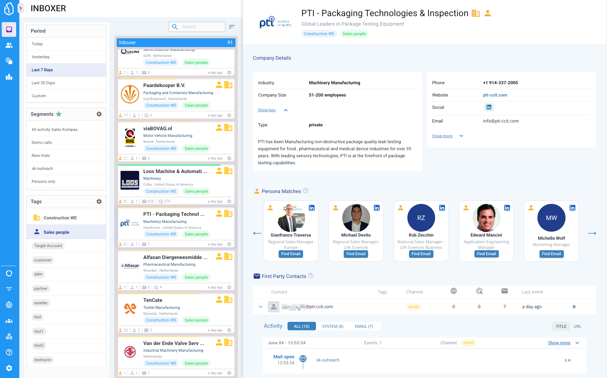
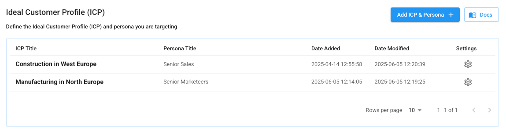
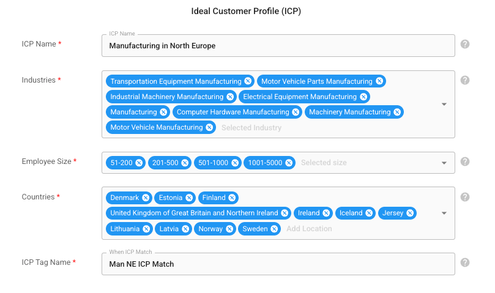
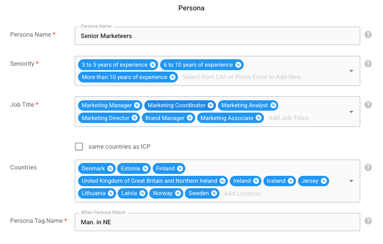
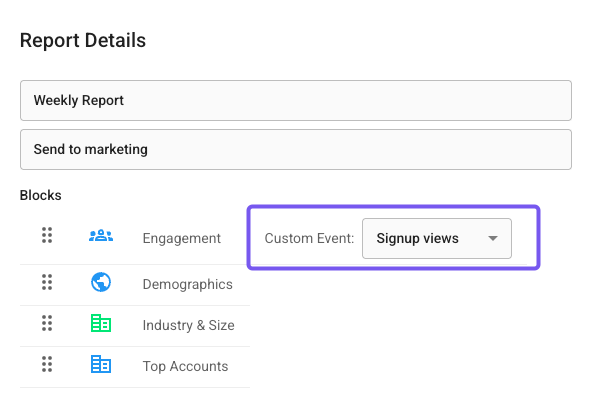

# Goals & Targets

The Goals & Targets page lets you define your Ideal Customer Profiles (ICP) and Personas, and also configure your conversion events.

## ICP & Personas

<figure><figcaption></figcaption></figure>

Define your Ideal Customer Profiles (ICP) and Personas so that LeadBoxer can automatically identify, tag, and find contacts to reach out to.

This feature improves lead qualification and sales focus by highlighting accounts and individuals that match your exact targeting criteria.

### How It Works

1. You define an ICP using:
   * Industry
   * Employee size
   * Country
2. You define the matching Persona using:
   * Seniority level
   * Job title(s)
   * Country (can match ICP or be separate)
3. When a company matches your ICP:
   * It will be tagged and surfaced in the platform
   * Matching personas from that account will be listed in the account detail panel
4. In the platform, you can now:
   * Filter on ICP and Persona matches
   * View their professional profile including current and past jobs or titles, education, etc.
   * Gather the personas business email address&#x20;

### LeadBoxer Credits

Each LeadBoxer Plan comes with a fixed amount of LeadBoxer credits, you can purchase additional credits if you want to find more personas or get more email addresses.

We will deduct 1 credit for each successful persona match or email lookup

### Overview table

<figure><figcaption></figcaption></figure>

in the overview, you can add, edit and delete multiple ICP + Persona combinations.

### How to Add ICP & persona combo

1. From the Goals & Targets page, you click Add ICP & Persona button.
2. this opens a window where you need to define your ICP and Persona
3.  First define the ICP

    <figure><figcaption></figcaption></figure>
4.  Then define the related Persona

    <figure><figcaption></figcaption></figure>
5. Save

### ICP & Persona Form Fields

Below is a breakdown of each section in the form:

#### Ideal Customer Profile (ICP)

<table><thead><tr><th width="181.1519775390625">Field</th><th>Description</th></tr></thead><tbody><tr><td>ICP Name</td><td>Internal name for the profile</td></tr><tr><td>Industries</td><td>Select one or more industries from the predefined list</td></tr><tr><td>Employee Size</td><td>Choose one or more company size ranges based on employee count</td></tr><tr><td>Countries</td><td>One or more countries or regions</td></tr><tr><td>ICP Tag Name</td><td>This label will appear in UI when a match is detected</td></tr></tbody></table>

#### Persona

<table><thead><tr><th width="187.28125">Field</th><th>Description</th></tr></thead><tbody><tr><td>Persona Name</td><td>Internal name for the persona configuration</td></tr><tr><td>Seniority</td><td>Experience level or decision-making authority</td></tr><tr><td>Job Title(s)</td><td>Select one or more job titles or departments </td></tr><tr><td>Countries</td><td>Country filters (can differ from ICP)</td></tr><tr><td>Persona Tag Name</td><td>This label will appear when a persona match is found</td></tr></tbody></table>

Note: You can link Persona countries to the ICP using the “same countries as ICP” checkbox.

***

### Best Practices

* Use specific job titles and seniority filters to minimize false positives.
* Create multiple ICP + Persona pairs for different segments or product lines.
* Revisit and refine your definitions periodically based on lead quality and conversion rates.

### Related Features

* [Inboxer](../inboxer.md)

***

## Conversion Target Events

The Conversions / Target Events page lets you define which website or behavioral events are considered critical milestones or conversions in your lead journey. These target events are highlighted throughout the application and are available for filtering, reporting, and automation.

This feature helps you focus on meaningful interactions such as signups, demo requests, or form submissions.

### How It Works

Each event is defined using a combination of:

* A name (used throughout the app and reports)
* A URL pattern to match the event (e.g., exact URL or partial match)
* An optional description to clarify what the event represents

Once defined, these target events:

* Can be selected in custom reports (as metrics)
* Are emphasized visually in the lead timeline <mark style="color:green;">(coming soon)</mark>
* Can be used to trigger workflows or qualify leads <mark style="color:green;">(coming soon)</mark>

### See Target events In your Reports

Target events can be added as custom metrics within reports. This allows you to:

* Track conversion rates over time
* Compare different lead segments by conversion behavior
* Visualize the impact of marketing or sales efforts

To use a defined event in reports:

1. Navigate to the Reports section
2. Add or edit a report
3.  in the Select a custom metric and choose your target event(s)&#x20;

    
<figure><figcaption></figcaption></figure>

