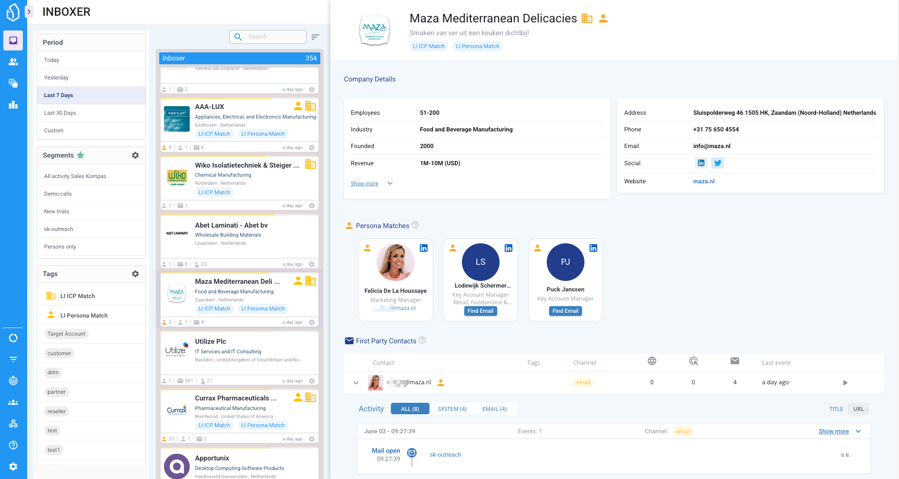

# Inboxer

## Inboxer View Documentation

Inboxer is the (new) default view of the LeadBoxer platform. It is designed to surface and prioritize company engagement insights — enabling you to act on high-intent leads quickly and efficiently.

<figure><figcaption>
Screenshot Inboxer 2025
</figcaption></figure>

***

### Interface Overview

Inboxer is split into three main areas:

<table><thead><tr><th width="145.91796875">Section</th><th>Purpose</th></tr></thead><tbody><tr><td>Left Sidebar</td><td>Apply filters: date range, segments, and tags</td></tr><tr><td>Center Panel</td><td>View Lead Cards with real-time activity and ICP/Persona signals</td></tr><tr><td>Right Panel</td><td>Inspect detailed company profiles, contacts, personas, and engagement data</td></tr></tbody></table>

***

### Account Cards (Center Panel)

Each company or organization is displayed as a Account Card, listed chronologically based on recent activity.

<table><thead><tr><th width="220.34375">UI Element</th><th>Function / Description</th></tr></thead><tbody><tr><td>Company Logo &#x26; Name</td><td>Visual anchor, quick recognition</td></tr><tr><td>Location &#x26; Industry</td><td>Contextual info about the lead</td></tr><tr><td>Colored Line (Top)</td><td>Indicates Lead Score intensity</td></tr><tr><td>Metrics</td><td>Visitors, events, email opens, last seen timestamp</td></tr><tr><td>Tags</td><td>Includes ICP Match, Persona Match, or custom tags</td></tr><tr><td>Gear Icon</td><td>Opens quick actions: delete or add to LeadBoard</td></tr><tr><td>Drag to Hotspots</td><td>Assign leads to boards or delete with intuitive drag-and-drop</td></tr></tbody></table>

> ICP = Ideal Customer Profile

> Persona = Buyer Role match based on your definitions

***

### Filters (Left Sidebar)

These filters refine the leads shown in your Inboxer timeline:

#### 1. Period

Choose a date range:

* Today, Yesterday, Last 7 Days, Last 30 Days, or Custom

#### 2. Favorite Segments

Segments marked as favorites (⭐) in the Segments overview. These are pre-filled at account creation and editable anytime.

\

#### 3. Tags

Key for lead qualification workflows. System-generated tags like:

* ICP Match
* Persona Match
* Plus: Custom user-defined tags (e.g. Customer, Partner, Hot Lead, etc.)

***

### Account Details Panel (Right Side)

Clicking an Account Card opens a detailed view with deep insights.

#### Company Info

<table><thead><tr><th width="192.9453125">Field</th><th>Example from Screenshot</th></tr></thead><tbody><tr><td>Employees</td><td>51–200</td></tr><tr><td>Industry</td><td>Machinery Manufacturing</td></tr><tr><td>Revenue</td><td>10M–50M USD</td></tr><tr><td>Address</td><td>Colby, Wisconsin, USA</td></tr><tr><td>Website</td><td><a href="http://loossmachine.com">loossmachine.com</a></td></tr><tr><td>Contact Info</td><td>Email &#x26; phone listed</td></tr><tr><td>Social Links</td><td>LinkedIn, Twitter, Facebook</td></tr><tr><td>Tech Stack</td><td>E.g. Microsoft 365, Typekit, Squarespace, Tawk</td></tr></tbody></table>

***

### Individuals Breakdown

#### 1. Persona Matches

People who match your ICP + Persona criteria:

<table><thead><tr><th width="225.8671875">Field</th><th>Example</th></tr></thead><tbody><tr><td>Name &#x26; Role</td><td>Stacy S, Sales Marketing Director</td></tr><tr><td>Profile Data</td><td>Includes LinkedIn icon, photo</td></tr><tr><td>Hover-over Info</td><td>Shows matching ICP + Persona pair</td></tr><tr><td>CTA</td><td>“Find Email” button</td></tr></tbody></table>

#### 2. First Party Contacts

Identified users based on:

* Email opens/clicks, form submissions, logins

<table><thead><tr><th width="228.3671875">Field</th><th>Example</th></tr></thead><tbody><tr><td>Contact</td><td>Email or Name (e.g. Stacy Schnabel)</td></tr><tr><td>Tags</td><td>Installed, Target Audience, etc.</td></tr><tr><td>Channel</td><td>Email, Web</td></tr><tr><td>Events</td><td>Pages, Clicks, Opens</td></tr><tr><td>Last Event</td><td>Timestamp of most recent activity</td></tr></tbody></table>

#### 3. Website Visitors

Unidentified individuals from the same company IP

<table><thead><tr><th width="242.5859375">Field</th><th>Example</th></tr></thead><tbody><tr><td>Contact</td><td>Visitor 1</td></tr><tr><td>Tags</td><td>Target Audience</td></tr><tr><td>Channel</td><td>Web</td></tr><tr><td>Events</td><td>Page views, system events</td></tr><tr><td>Last Event</td><td>e.g. 2 months ago</td></tr></tbody></table>

> Click any visitor or contact row to drill into full behavioral and session-level details.

***

### Hotspot Actions

At the bottom of the Lead Card column are Hotspot Drop Zones:

| Zone             | Action                        |
| ---------------- | ----------------------------- |
| 🟩 Move to Board | Assign lead to a saved board  |
| 🟥 Delete        | Remove from inbox permanently |

Drag a lead card onto these zones for fast triage.

***

### Summary

Inboxer is your daily operational hub for:

* Monitoring real-time company engagement
* Triaging leads with fast tagging and scoring
* Surfacing ICP & Persona matches automatically
* Accessing detailed contact and session data

It combines power and usability into a single, efficient lead intelligence interface.
