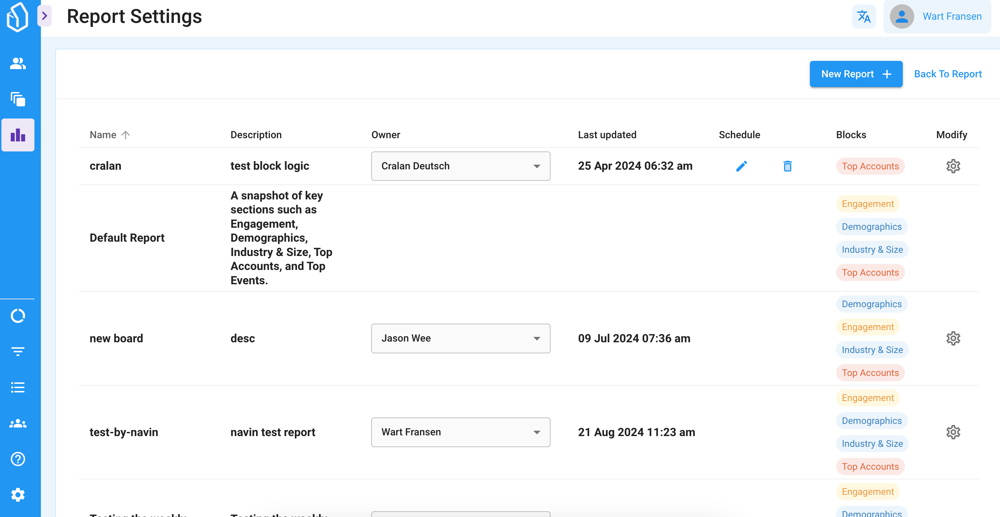

# Batch operations

The Lead & Accounts reports includes a feature that lets you modify multiple Leads in one 'job' or operation.

Simply make your selection using the filters and date-range selector, select an action and start the Batch job.

### Available Actions

We currently support the following  actions:

* Add Lead Tag(s)
* Remove Lead Tag(s)
* Add to LeadBoard (or change stage)
* Delete from LeadBoard

## How to start a Batch Operation

In general, here is how you can start a batch Operation:

1. Login to your LeadBoxer account&#x20;
2. Select the correct dataset&#x20;
3. Make your selection:
   1. Select the correct date-range
   2. Apply filters&#x20;
   3. click the Batch button
   4. click the 'select all' checkbox
4. Choose your Action or Operation
5. Start.

<figure><figcaption></figcaption></figure>


Depending on the action type, list size and number of leads in your account , it might take a few minutes to batch process all the changes.


## Batch Jobs Overview

Once you started a Batch Job, you can see the progress for the batch operations and the history in the batch Jobs overview.

<figure><figcaption></figcaption></figure>

On the Batch Jobs overview you can see the current jobs, and the history of jobs that were run in the last 30 days.

<figure><figcaption></figcaption></figure>
