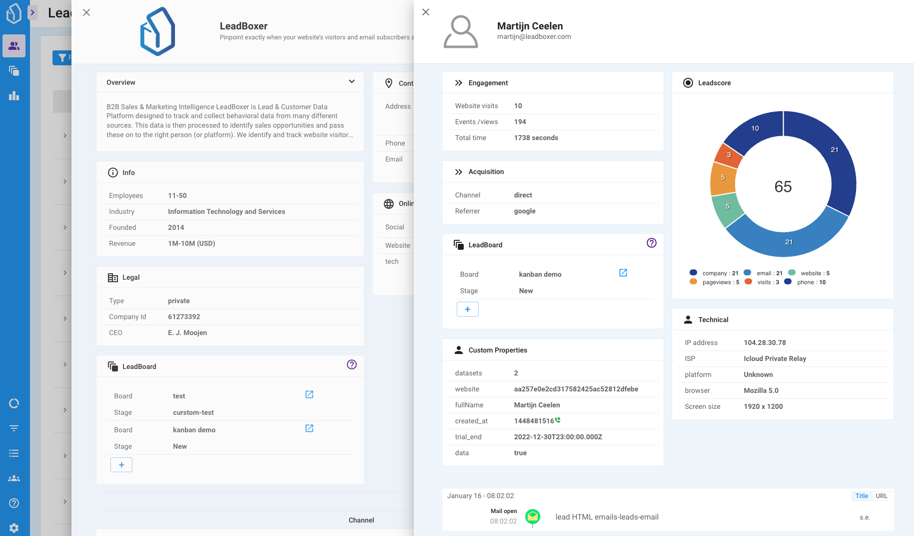

# Leads & Accounts

## The main page of LeadBoxer

Once you login, you will arrive on a page called **Leads & Accounts**. This page /screen / report / view is the beating heart of LeadBoxer.&#x20;

Here you will be able to see all your Leads and Accounts (hence the name) to apply filters, create segments, import, export data, hide, remove, group, merge and many other operational tasks.&#x20;

It is also the place to research and drill down into your data to find opportunities or other pieces of information you were not aware of.&#x20;

On this page you will find a complete overview of the page and links to all the relevant sections, definitions or elements.

<figure><figcaption>
The Leads &#x26; Accounts page 
</figcaption></figure>

### What is the Leads & Accounts page?

In one sentence: a list displaying all your Leads; which can be grouped into Accounts.


For an explanation of [Leads](definitions.md#what-are-leads) and [Accounts](definitions.md#what-are-accounts), please read our [definitions](definitions.md).


The Leads and/or Accounts are rendered in a table or grid which can be customized to show or hide additional columns. You can choose from a wide range of properties or behavioural fields. You can customize the columns by clicking on the column icon and  choose to show/ hide. you can also search for specific columns.

<figure><figcaption></figcaption></figure>

### Summary Columns

In order to provide a snapshot of each lead without horizontal scrolling, we created a Summary Column in 3 versions: Small, Medium, Large.

* **Small** contains only the name of the organization and the name or email of the Lead.
* **Medium** adds the lead tags and LeadBoards the Lead or Account is on.
* **Large** adds Employee count, Industry, Revenue and last activity.

### Column sets

By default we show a selection of columns, but we encourage you to create your own and save them as a 'column set'.

You can save your prefered view as a column set to quickly find your preferred set of columns.

The Column set selector also provides the option to select the [LinkedIn Matched Audiences](elements/import-and-export/linkedin-matched-audiences-export.md) column sets for both Leads (contacts) and Accounts (Companies).

### Lead Details Drawer

If you click on any lead, this will open the Lead Details Drawer. The drawer contains numerous details about the individual lead on i) profile information, ii) individual behaviour and iii) the option to drill-down to associated organization.

<figure><figcaption></figcaption></figure>

The Lead details drawer contains multiple items, listed and described below:

* Engagement
* Acquisition
* LeadBoard
* Custom Properties
* Leadscore
* Technical
* Clickstream
* Organization

#### Engagement

This item shows a summary of stats on  behaviour, such as events (pageview, email opens, etc) website visits, time on site, etc.

<figure><figcaption></figcaption></figure>

#### Acquisition

In LeadBoxer we primarily focus on Leads that are acquired through digital channels. Leads from trade shows, events, showrooms, etc are other examples which can be added. It is important to keep track your acquisition channels to provide insights into which successful channels to invest in.

<figure><figcaption></figcaption></figure>

#### LeadBoard

See what LeadBoard this lead or Account is on, or quickly add them to any existing LeadBoards.

<figure><figcaption></figcaption></figure>

#### Custom Properties

Your custom Lead properties are displayed here. Learn how to [add your own custom properties](projects.md#custom-properties)&#x20;

<figure><figcaption></figcaption></figure>

#### Leadscore

See how the Leadscore for any lead is calculated. Refer to our help docs to learn more on [how the Leadscore works](projects.md#leadscore).&#x20;

<figure><figcaption></figcaption></figure>

#### Technical

A section showing technical details about the browser, email client, connection, network, etc.

<figure><figcaption></figcaption></figure>

##
