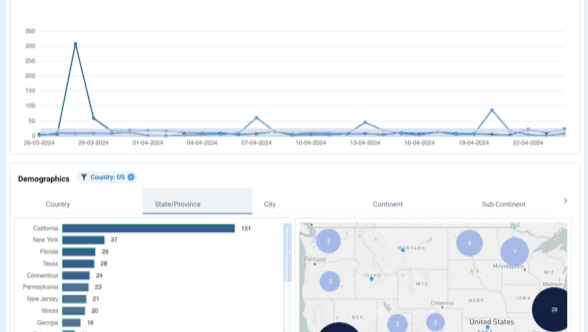

# Reports

<figure><figcaption></figcaption></figure>

The Reports feature is a summary overview of all data we have collected in a certain period.

## Blocks

Reports can be customized using 'blocks'. Each block is a subset of your data, we currently support these blocks.&#x20;

* Engagement
* Demographics
* Industry & Size
* Top Accounts
* Top Events <mark style="color:green;">(coming soon)</mark>
* Top Campaigns <mark style="color:green;">(coming soon)</mark>
* LeadBoard Analytics <mark style="color:green;">(coming later this year)</mark>

### The Engagement Block

<figure><figcaption></figcaption></figure>

This graph allows you to see the daily history or trend of your audience, and has the following features:

* Select either Visitors, Leads, Accounts, Contacts or Events
* Use the date-range selector to select your period. &#x20;
* Open the filters pannel to select any of your [Segments](elements/segments.md).&#x20;
* Switch between bar and line chart
* Enable / disable comparison metrics for the period before
* hover to the chart to see actual values for that day. &#x20;

You

## Benefits or use cases

### Visualize your Segments

You can select any of your Segments in Report and the graphs and chart and tables will visualize this subset of your data.

<figure><figcaption></figcaption></figure>

### Slice and drill-down to accounts view

You added the option to ‘slice’ the data on our dashboard, by clicking on any of the donut chart pieces.

We also added a the option to drill down directly to the accounts view.

<figure><figcaption></figcaption></figure>

Once sliced you can see these labels

<figure><figcaption></figcaption></figure>
