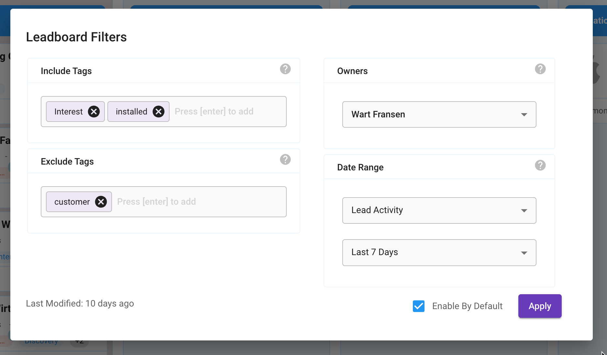

# Reports

<figure><figcaption></figcaption></figure>

The Reports feature is a summary overview of all data we have collected for a certain period.

## Blocks

Reports can be customized using 'blocks'. Each block is a subset of your data, we currently support the following blocks:&#x20;

* Engagement
* Demographics
* Industry & Size
* Top Accounts
* Top Events <mark style="color:green;">(coming soon)</mark>
* Top Campaigns <mark style="color:green;">(coming soon)</mark>
* LeadBoard Analytics <mark style="color:green;">(coming later this year)</mark>

### Engagement block

<figure><figcaption></figcaption></figure>

This graph allows you to see the Daily history or trend of your audience, and has the following features:

* Select from Visitors, Leads, Accounts, Contacts or Events
* Open the filters panel to select any of your [Segments](elements/segments.md)&#x20;
* Switch between bar and line charts
* Enable / disable comparison metrics for the 'period before'
* Hover over chart to see Daily actual values &#x20;

### Demographics block

<figure><figcaption></figcaption></figure>

Use this chart and graph to get insights into the geographical locations of your users. Features include:

* Choose from Countries, Regions, Cities, Continents, Sub-continents or Sales Regions
* Clicking on the in-chart bars allows you to:
  * Slice or zoom in to Country, Region or City
  * Apply the location filter and see  Leads and Accounts per area&#x20;
* Using the map chart to zoom in, by scrolling your mouse-wheel&#x20;

### Industry and Size block

<figure><figcaption></figcaption></figure>

See what type of audience you are interacting with, find out if you're targeting the right companies.

Features include:

* Industry Group chart: Individual companies grouped by the [LinkedIn Industry definitions](https://learn.microsoft.com/en-us/linkedin/shared/references/reference-tables/industry-codes-v2#active-nodes)
* Detailed Industry chart: Each and every industry ranked&#x20;
* Organization size chart: Based on employee count; see a breakdown of your audience
* Clicking on the in-chart bars allows you to:
  * Apply the industry or size filter and see the actual Leads and Accounts from that group &#x20;
  * Slice the report to only include this industry or size

### Accounts block

<figure><figcaption></figcaption></figure>

Find out what companies are your top engagers. Features include:

* Sort on each column
* Filter on each column
* Double-Clicking on a row will take you to the individual Leads from that Account&#x20;

## Generic features

### Report on your Segments

You can select any of your Segments under the Filters menu, and graphs, charts, and tables will visualize this subset of your data.

### Date range

Use the date-range selector to select your period. &#x20;

***

## Report Settings

Use the Report setting to list, create or modify your Reports

Settings you can modify:

* Change Name and Decription
* Set Ownership (only owners and admins can make changes)
* Set scheduling, for weekly or monthly delevery
* Change the Blocks (elements) on your report. you can enable disable the various blocks and also change the order.
* Delete the Reports (you own)

<figure><figcaption></figcaption></figure>

## Download / Export as PDF

Download your reports by clicking the “Export as PDF” button. This will generate a PDF version of the current report in the background. Once it’s ready, we’ll send you an email with a download link.

#### Customization options

The downloaded report can be customized by adjusting the settings you apply on the screen. These settings will also reflect in the PDF, including:

* Selected Segment
* Selected Date Range
* Chart Type (Engagement block)
* Compare with Previous Version (Engagement block)

#### Limitations

Due to some technical limitations we currently do not support the map feature (yet).

We also have limited the demographic details to Country and Sub-continent. Please let us know if you need other options.

Segmentations that have been applied inside the Report are currently not supported in the PDF version. To apply additional filters, start by creating a segment and then select it as your starting point.

### Scheduled Reports

Using the scheduling feature, you can automatically create PDF reports delivered to your inbox either weekly or monthly.&#x20;

Click the dropdown icon next to the 'Export as PDF" button and create a new scheduled Reports.

<figure><figcaption></figcaption></figure>

Choose to receive the Report either weekly or monthly, and select your recipients.

<figure><figcaption></figcaption></figure>


Note: Recipients need to be added to your account as [Users](elements/users.md) before you can select these for a scheduled report.&#x20;


Once a Report has been scheduled, the dropdown allows you to check the scheduling details or modify the settings.\

<figure><figcaption></figcaption></figure>

If you are not the owner of a report and choose to set up a schedule, we will create a copy of the report in the background and make you the owner.

