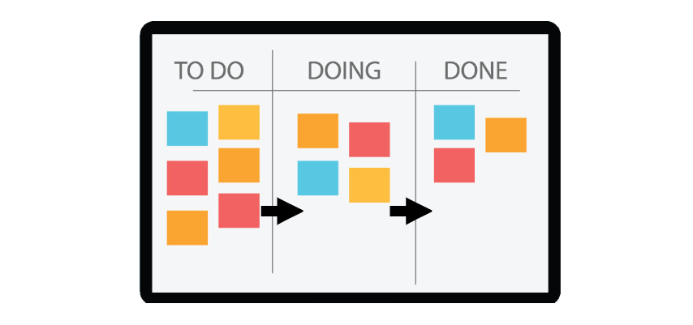
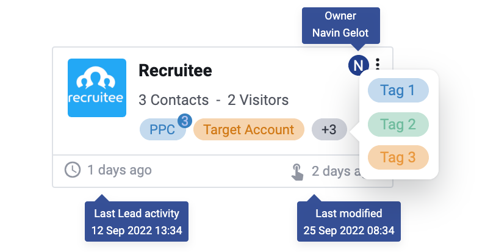

# LeadBoard

## What is the LeadBoard

The LeadBoard is a [kanban](https://en.wikipedia.org/wiki/Kanban)-style overview of your Leads & Accounts, where you can qualify, annotate, investigate, and manage your leads. It allows you to keep track of your most important Leads and their journey towards Sales opportunities and eventually new customers.

The concept is not super complicated (that is the beauty of it) and you might already be familiar with it as many tools already have used the concept, the most well-known tool is Trello.

<figure><figcaption>
The basic Kanban board
</figcaption></figure>

In our case, we have applied the concept so that each 'card' on your LeadBoard represents a Lead or Account. The natural flow is that your cards or Leads move from left tot right as they travel through your marketing workflow or funnel.&#x20;

<figure><figcaption>
The LeadBoxer LeadBoard
</figcaption></figure>

#### Now here are the 3 things that make it super powerful:

1. All the leads that need to be qualified will be added automatically to the first column
2. You can create [workflow automations](elements/workflow-automation.md) to automatically move leads on your leadboard 'down the funnel' based on behaviour or specific Lead details.
3. You can get a notification when Leads enter the last stage of phase in your qualification funnel. (or any other stage) and trigger a sync with various integrations.

In most cases, the first column should contain only leads that are automatically pre-qualified with some sort of filter (eg country or Industry). The final column is where you offer or handover the Lead to Sales, and basically saying that you think this Lead is ready to be contacted, ready to be closed, ready to buy, or basically anything.

## Getting started

During the onboarding, we have automatically setup your first LeadBoard. If not, you will get asked to create your first LeadBoard yourself.


Before you continue, we recommend you&#x20;

1. Make sure you have an internal workflow defined: eg a marketing funnel, lead generation or lead qualification workflow.&#x20;
2. Optionally, you can create a [Segment](elements/segments.md) that contains the Leads you want to be automatically imported into your board.


To create a LeadBoard, you click on the 'Create LeadBoard' button and follow these 3 steps to complete:

1. Create LeadBoard
2. Define Stages
3. Import Data

Use below guide to start using the LeadBoard feature


[creating-your-first-leadboard.md](../guides/creating-your-first-leadboard.md)


## Using the LeadBoard

Once you have Leads showing up in your default or entry stage, the high-level goal is that you move as much cards from left to right, if they are allowed to be moved according to your workflow.&#x20;


We recommend that all movement of cards should be based on your internally defined marketing or Lead Gen workflow. If you have not defined this yet, we recommend you create one first.&#x20;


### Lead or Account Cards

Leads that are added to the LeadBoard are grouped on Account. Meaning that multiple visitors or contacts from the same company or domain are grouped into one one card on the board.&#x20;

<figure><figcaption></figcaption></figure>

### LeadBoard Card or Account details

You can click on any LeadBoard Cards to see all the details of the account and all the associated Leads.

<figure><figcaption></figcaption></figure>

### Associated Leads

Once you opened a LeadBoard Card and see the Account or Card details, you can scroll down and see all the identified contacts and unidentified website visitors from this organization:

<figure><figcaption></figcaption></figure>


If you want to know more about the LeadBoard card Account details and ossociated leads, see [the section below](tasks.md#account-card-details)


### Lead Tags

Each Card can contain [Lead Tags](tasks.md#lead-tags). Because tags are set on the individual Lead level, we will show all the Lead Tags for all the individual Leads from one organization on that card.

### Ownership

LeadBoard Cards can have an owner. Once an owner has been set, the icon of the owner will appear in the header bar. you can click on one or multiple owners to see their cards.


For more details on LeadCards you can [see below](tasks.md#leadboard-cards)


### Search

You can search for a specific card by using the search feature. It will search through the organization name and domain name fields.

### Sorting

You can sort or re-order your cards based on&#x20;

* The last activity timestamp of any of the individual leads in a card
* The last modification timestamp of the account card, indicating when the card was added or moved.

### Manually adding Leads to the Leadboard

You can manually add leads to the board by providing the domain name (website) of the organisation or company. Our enrichment engine will try and find the associated firmographic details and once accepted the card will show up in the default or entry stage.

We will also search through your data and connect any leads or contacts that are associated to this domain name.

## Example cases

There are many different ways you can use the LeadBoard, so to give you some inspiration, here are use-cases on how we use the LeadBoard ourselves.

#### Use case Example 1: Trial Qualification workflow

Many visitors to our site sign up for a trial account, which is great. However, there are many visitors and trial accounts that for one reason or another we think are not qualified and we do not want these to 'pollute' our CRM. To avoid this we use the LeadBoard.

* First we have created a Segment called 'Trials-to-qualify' that already filters out certain trials , for example very small organisations, as we know they usually do not have the budget to purchase LeadBoxer.
* We have setup a Board called 'Trials' and auto import the leads from the 'Trials-to-qualify' Segment so they auto appear in the first column.
* Every morning, one of us has a look at this LeadBoard and checks out the new trials.
* In our case, we have a few steps in between, before we consider them qualified and will put some sales effort in.
* To see if a lead is qualified to go to the next step, we analyze the data collected, which we can see by clicking on an individual LeadCard and see all the details of the organisation, and all the behaviour of this individual lead.
* Now based on their behaviour, eg trial activation, number of logins, users added, industry, size, etc these leads can go through a couple of qualification stages we have defined internally.&#x20;
* Once we move a lead card in the final stage, they will automatically go into a second Segment called 'Qualified Trials"&#x20;
* This Segment is connected to our CRM (Pipedrive) and will push these qualified leads to our CRM so that our Sales team can do their magic.

## LeadBoard cards

If you have setup and configured your LeadBoard, your LeadBoard cards will appear on the board.

<figure><figcaption></figcaption></figure>

* Each cards represents an Account or Organization.&#x20;
* Cards are uniquely grouped based on a domain-name and/or Organization Name.
* Cards are updated in the background.&#x20;
* Cards contain:
  * Company Logo
  * Organization Domain or Name
  * The number of Contacts (Leads with email known)
  * The number of Visitors (Anonymous Website visitors from this organization)
  * All the different Tags that are applied to these leads
  * The number of occurrences of each tag
  * The last activity date-time of any of the leads in this account
  * the last modification of the account card, indicating when the card was&#x20;
    * Initially Created
    * Moved between stages manually (not within same stage)
    * Moved between stages when deleting a stage
    * When a new note is added to the Account card

## Account card details

The Account details section on the Account Pannel shows the (enriched) company or organization information that is available based on the domain-name of the organisation.

### Leads

The Leads details section shows a list of individual leads (or contacts) with some lead details such as marketing channel, sessions, events, etc.&#x20;

You can click on any Lead to expand this lead and this will reveal the last 5 sessions and their complete behaviour or clickstream. You can continue clicking to reveal 5 more sessions.&#x20;

If there is only one lead in the account we will expand the lead automatically.

### &#x20;The Behavioural stream&#x20;

This subsection of an individual lead or contact contains the sessions and all the 'events' or actions that were tracked or registered within these sessions.&#x20;

Sessions are usually a group of events. and there are several kind of events that we automatically detect:

* pageview
* referrer
* exit&#x20;
* email open
* email click
* card update / status

Some events can contain meta data such as marketing tags (utm).

We will also show when a lead was added to the leadboard.

#### Background Lead Operations

While you are successfully managing your leads in your LeadBoard(s), your Leads are not sitting still and perform all kinds of behaviour. To make sure this behaviour is reflected on your LeadBoard, we are checking each lead in your LeadBoard every hour and update the details if necessary.

&#x20;

