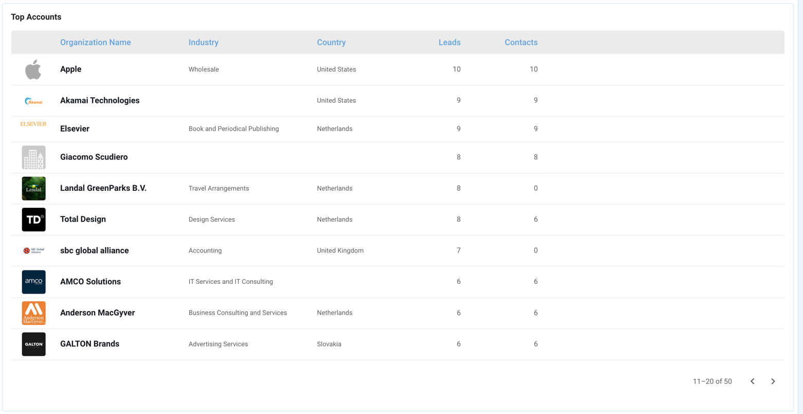

# LeadBoard

## What is the LeadBoxer LeadBoard

The LeadBoard is a [kanban](https://en.wikipedia.org/wiki/Kanban)-style overview of your Leads & Accounts, where you can qualify, annotate, investigate, and manage your leads. It allows you to keep track of your most important Leads and their journey towards Sales opportunities and eventually new customers.

The concept is not super complicated (that is the beauty of it) and you might already be familiar with it as many tools already have used the concept, the most well-known tool is Trello.

<figure><figcaption>
The LeadBoxer LeadBoard
</figcaption></figure>

In our case, we have applied the concept so that each 'card' on your LeadBoard represents a Lead or Account. The natural flow is that your cards or Leads move from left tot right as they travel through your marketing workflow or funnel.&#x20;

The final step in your LeadBoard should be the step in your workflow where you offer or handover the Lead to Sales, and basically saying that you think this Lead is ready to be contacted, ready to be closed, ready to buy, or basically anything.

## Getting started

If you arrive at the LeadBoard for the first time, you get asked to create your first LeadBoard.

To create a LeadBoard, you click on the 'Create LeadBoard' button and follow these 3 steps to complete:

1. Create LeadBoard
2. Define Stages
3. Import Data

### 1. Create New LeadBoard

There are 4 items we need to create a LeadBoard.

<figure><figcaption>
Step 1 of Create new LeadBoard wizard
</figcaption></figure>

* Provide a name for your LeadBoard. We recommend a short and descriptive name, so that all users understand what the goal of the board is. eg. Demo signups, LinkedIn campaign leads, EU Leads, etc.
* Select the Dataset / site.&#x20;
* Select the [Segment](task-lists.md) from which the matched leads will be automatically imported in this LeadBoard.
* Set the visibility of this LeadBoard to be visible to only you or anyone that has access to this dataset.
* Click Next

### 2. Define stages

Based on you internal marketing workflow, add the stages so that your LeadBoard matches the steps you have defined to qualify or manage your leads. If you have not done this yet, we recommend you read this tutorial first: Define Your Marketing Workflow.&#x20;

<figure><figcaption>
Step 2 of Create new LeadBoard wizard
</figcaption></figure>

* For each workflow step, add a Stage and provide a descriptive name
* Once all steps are defined, make sure they are in the right order (you can drag & drop to change the order)&#x20;
* Check if the correct column is the 'entry' stage. This is the stage where leads will be added by either the auto import or manually.
* Click Next


We recommend to to start simple, with a minimum of 3 stages. You can always revisit and modify if needed later.&#x20;


### 3. Import Leads

Now that you have created your LeadBoard and defined the stages, you can start managing your leads right away by importing your existing LeadBoxer leads into your new LeadBoard.

<figure><figcaption>
Step 3 of Create new LeadBoard wizard
</figcaption></figure>

You can choose data from today, last 7 days or last 14 days.

Click import, to perform this step or skip and start with a clean LeadBoard.

### Background Lead Operations

While you are successfully managing your leads in your LeadBoard(s), your Leads are not sitting still and perform all kinds of behaviour. To make sure this behaviour is reflected on your LeadBoard, we are checking each lead in your LeadBoard every hour and update the details if necessary.&#x20;

