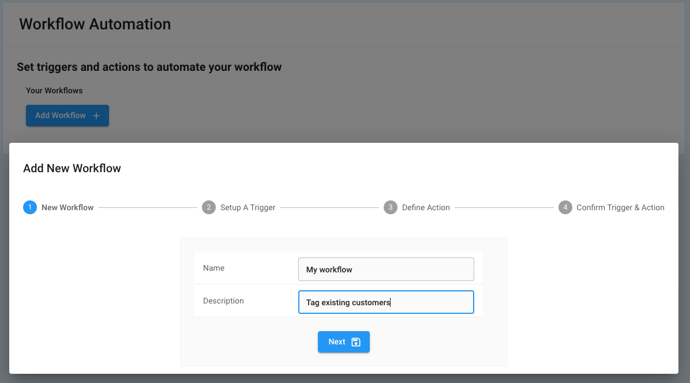
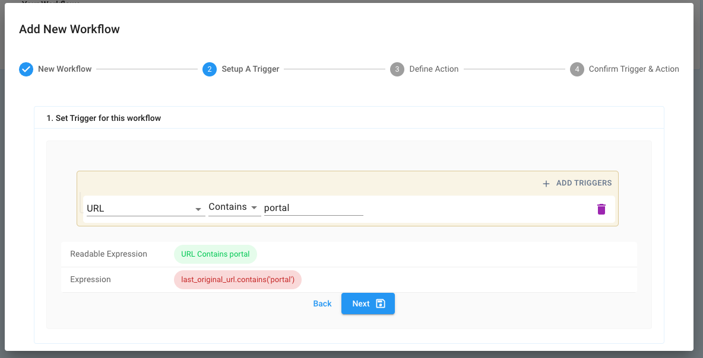

# How to create a Workflow Automation

To add your first Workflow, log into LeadBoxer as Admin and find the Workflow Automations section in the navigation.

1. Click Add Workflow
2.  Provide a Name and Description for your workflow.

    <figure><figcaption></figcaption></figure>
3.  Add one or more Triggers and configure to 'fire' when specific criteria are met.

    <figure><figcaption></figcaption></figure>
4.  Define your action(s). What do you want to happen?

    <figure><figcaption></figcaption></figure>
5.  Review your Workflow automation and save.

    <figure><figcaption></figcaption></figure>

Going forward, each new event or piece of data that goes through our engine will be evaluated to  match triggers and execute the relevant action(s) when triggers are met.

Please let us know if you are missing a trigger or action!

