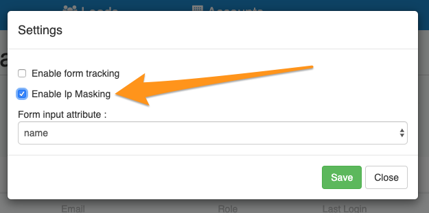

# How to mask IP addresses

**IP Address Masking** allows you to anonymize computer IP addresses by setting IPv4 IPs and IPv6 IPs to zeros. Depending on your requirements, you can now enable this feature per dataset. Note that anonymization is done at storage level, meaning we will still use the IP address to identify the company, organisation, location and other (generic) profile data but the IP address is never written to disk.

This is useful if you do not want to mention LeadBoxer in your privacy statement. If that is the case, for EU GDPR compliance you need to anonymize IPs (unless capturing and storing IPs is absolutely necessary for purposes such as legal investigation, transaction fraud prevention, etc.).

### How to enable IP masking

you can enable IP masking for each dataset in your account.&#x20;

To do so, go to your datasets overview (you need to be an admin to see this) and tick the ip-masking option in the settings window.

<figure><figcaption></figcaption></figure>
