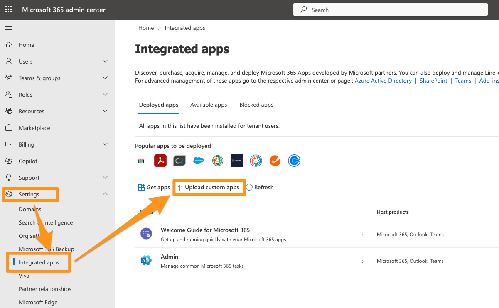

# Advanced Outlook Add-in

_LeadBoxer has 3 different Outlook plugins:_

1. [_The Official add-in_](https://docs.leadboxer.com/article/148-outlook-365-outlook-for-mac-outlook-in-browser)
2. _The Advanced add-in_
3. _The Legacy plug-in_&#x20;

**This page is documentation for the Advanced Outlook add-in**

The Advanced add-in is identical to the [Official add-in](https://docs.leadboxer.com/article/148-outlook-365-outlook-for-mac-outlook-in-browser), AND replaces the need to activate the tracking for each email with an auto-enable option.&#x20;

To Install the Advanced version, first make sure you do not have the Official version installed.&#x20;

**For individual install**

1.  Go to the add-ins section in your outlook

    <figure><figcaption></figcaption></figure>
2. Click on the **My add-ins** tab and scroll down to Custom Add-ins
3. Click on **Add custom Add-in** and select **Add from URL**
4. paste URL: [**https://subscription.leadboxer.com/LeadboxerOutlookWebPlugin.xml**](https://subscription.leadboxer.com/LeadboxerOutlookWebPlugin.xml) and click ok

This should install the advanced add-in. You can use the instructions from the official add-in to continue.

### Install the Advanced Add-in as Ms Office Admin

1. Log into your Microsoft 365 Admin Center
2. Go to Settings > Integrated apps, and click **Upload Custom Apps**

<figure><figcaption></figcaption></figure>

3.
4. Select Office Add-in for App type
5. Click on Provide Link to manifest file radio button
6.  paste URL: [**https://subscription.leadboxer.com/LeadboxerOutlookWebPlugin.xml**](https://subscription.leadboxer.com/LeadboxerOutlookWebPlugin.xml) and click Validate

    <figure><figcaption></figcaption></figure>
7. make sure Test deployment is set to No
8.  Assign users according to your preferences. We recommend Specific users/groups.

    <figure><figcaption></figcaption></figure>

9. Accept permissions requests
10. Review and finish deployment

This should deploy and enable the Advanced version of the Add-in for the selected users and automatically track all the emails they send.
