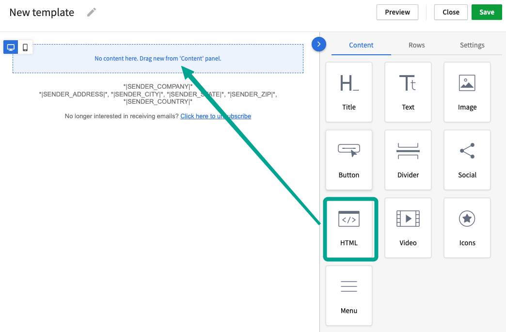

# Pipedrive Campaigns

### Step 1: Track email opens

To track mail open/reads from your Pipedrive Campaigns into LeadBoxer, you need to add a LeadBoxer tracking pixel to your campaigns or templates.&#x20;

Here are the steps needed for adding the tracking pixel

1. Go to your campaign or template
2.  Add an HTML element in where we can add our tracking pixel

    <figure><figcaption></figcaption></figure>
3. paste in your email tracking pixel in the HTML element:


```html

```


Close and Save

Notes:

* Don't forget to change the <mark style="color:red;">DATASET ID</mark> to your own
* Change the campaign value to reflect the email title or campaign name&#x20;
* You can add other template variables as parameters if you have them, eg&#x20;

```url
&firstName=*|FIRST_NAME|*
```


Pipedrive does not list all the merge fields you can use in their documentation, but you can get these by using the merge tag dropdown.



### Step 2: Track email clicks and identify prospects on your site

To track email clicks, you need to modify the links inside your email campaigns and add this parameter to the URL of the link:

**`?email=*|EMAIL|*`**

This will allow us to identify the individual visitors when they land on your site.

Optionally but recommended, you should add additional parameters to enrich the visitor with other information from your database:

**example URL**


```url
https://www.YOURDOMAINNAME.com/my-landing-page/?firstName=*|FIRST_NAME|*&lastName=*|LAST_NAME|*&email=*|EMAIL|*&companyName=*|ORG_NAME|*
```


Tip: Best practice is to test before sending out a mass email

***

To see more on For more details see these pages:

[https://support.pipedrive.com/en/article/drag-drop-editor](https://support.pipedrive.com/en/article/drag-drop-editor)
