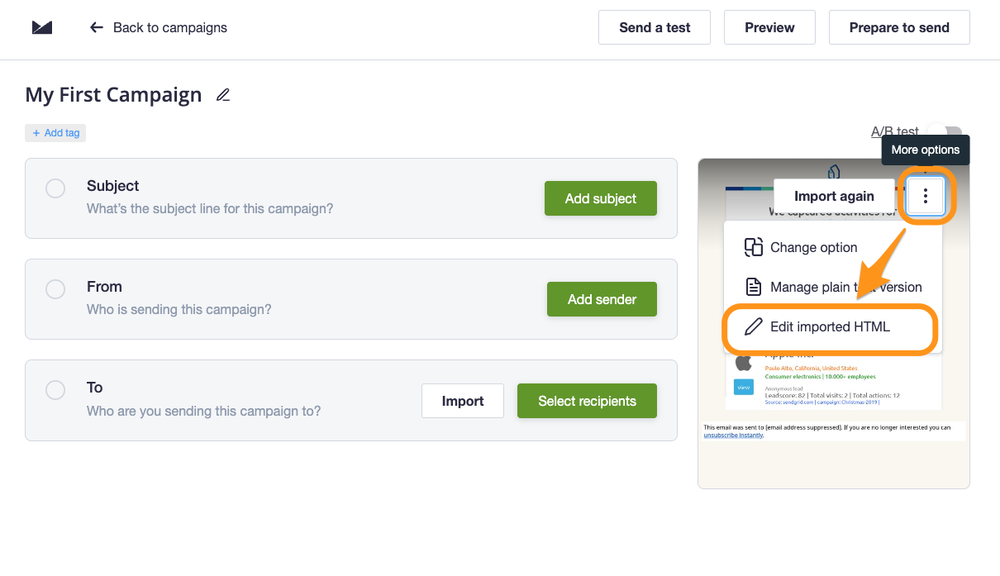
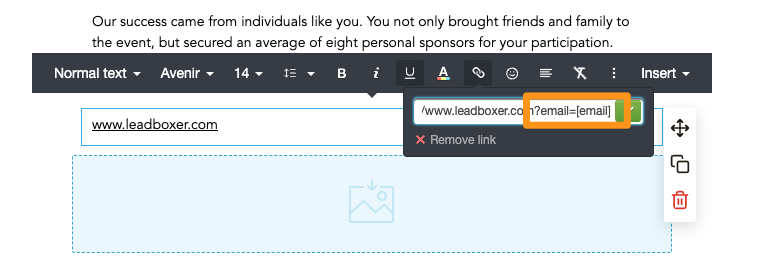

# Campaign Monitor

### Identify & track Campaign Monitor email recipients on your website&#x20;

#### Step 1: Track email opens


The **Email builder** from Campaign Monitor does not support HTML editing. Meaning we can only track email opens if your emails are created using the **Import HTML** method.


To track mail open/reads from your Campaign Monitor audience in LeadBoxer, you need to add a LeadBoxer tracking pixel to your campaigns or templates.&#x20;

Here are the steps needed for adding the tracking pixel:

1. Go to your campaigns
2. Choose the mail template you want to track
3.  Edit the HTML:

    <figure><figcaption></figcaption></figure>
4.  In the HTML add the tracking pixel at the bottom of the email, before the end body tag:

    <figure><figcaption></figcaption></figure>


```html

```


5. Save

**Notes:**

* Don't forget to change the DATASET ID to your own.&#x20;
* You can add additional data fields variables as parameters by simply adding these to the pixel, eg \&firstName=\[firstname], etc
* For more details on advanced data fields in Campaign Monitor see:&#x20;
  * [https://help.campaignmonitor.com/access-the-html-of-an-email](https://help.campaignmonitor.com/access-the-html-of-an-email)

### Step 2: Track email clicks (click-thrus) and identify prospects on your site

To track email clicks, you need to modify the links inside your email campaigns and add this parameter to the URL of the link:

**\&email=\[email]**

This will allow us to identify the individual visitors when they land on your site.

<figure><figcaption></figcaption></figure>

Optional, but recommended; add additional parameters to enrich visitors with additional information from your database:

**example URL**


```url
https://www.YOURDOMAINNAME.com/my-landing-page/?firstName=[firstname]&lastName=[lastname]&email=[email]
```


NOTE: remember to update the landing page with your url.\
Tip: Best practice is to test before sending out a mass email
