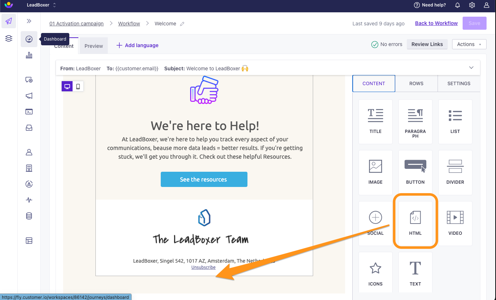
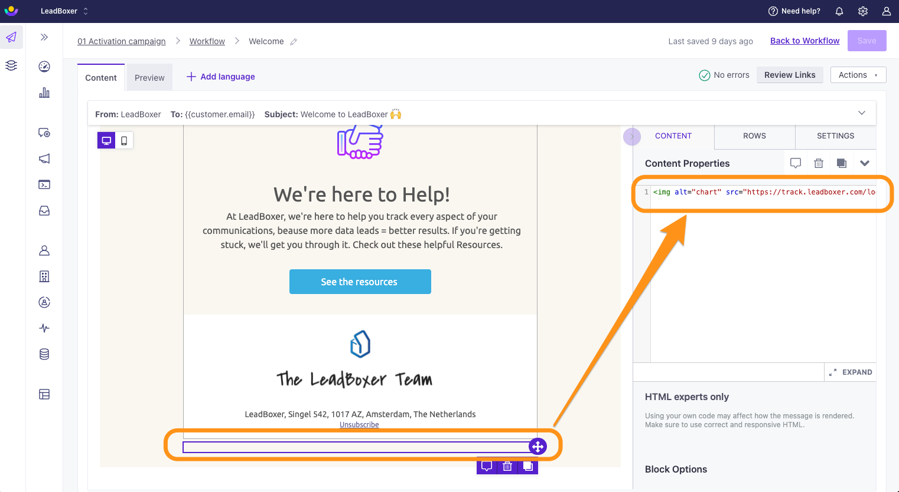
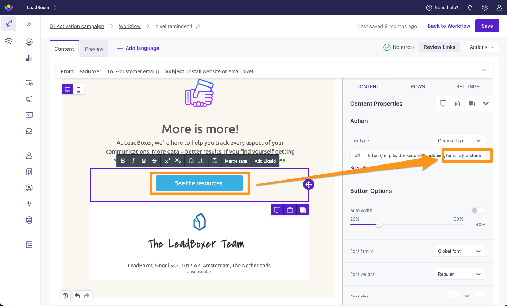

# Customer.io

### Identify & track Customer.io email recipients on your website

### NOTE: this is a two-step process&#x20;

#### Step 1: Track email opens

To track mail open/reads from your Customer.io contacts in LeadBoxer, you need to add a LeadBoxer tracking pixel to your campaigns or templates.&#x20;

Here are the steps needed for adding the tracking pixel:

1. Go to your Campaigns, Broadcasts or Transactional templates
2. Choose the mail template you want to track
3.  Add an HTML content type to the bottom of your template or email

    <figure><figcaption></figcaption></figure>
4.  Click on the HTML block and paste your email tracking pixel into the box:

    <figure><figcaption></figcaption></figure>


```html

```


5. Save


**Notes:**

* Don't forget to change the DATASET ID to your own.&#x20;
* You can add additional data fields variables as parameters by simply adding these to the pixel, eg \&companyName=\{{customer.company\}} or \&firstName=\{{customer.firstName\}}, etc.
* For more details on advanced data fields in Customer.io see:&#x20;
* [https://customer.io/docs/journeys/drag-and-drop/#personalize-messages-with-user-data](https://customer.io/docs/journeys/drag-and-drop/#personalize-messages-with-user-data)

### Step 2: Track email clicks (click-throughs) and identify prospects on your site

To track email clicks, you need to (a) modify the links inside your email campaigns and (b) add this parameter to the URL of the link:

**?email=\{{customer.email\}}**

This will allow us to identify the individual visitors when they land on your site.


<figure><figcaption></figcaption></figure>

Optional, but recommended; add extra parameters to enrich visitors with additional information from your database:

**example URL**


```url
https://www.YOURDOMAINNAME.com/my-landing-page/?firstName={{customer.firstName}}&lastName={{customer.lastName}}&email={{email}}&companyName={{customer.companyName}}
```


NOTE: remember to update "my-landing-page" with your url.


Tip: Best practice is to test before sending out a mass email

