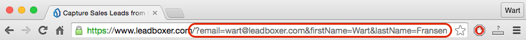

# Intercom

This tutorial tells you how to use leadBoxer email tracking for individuals originating from your Intercom emails.

Leadboxer will show you the email of the person who clicked through the email, simply by adding a special link in the emails sent and adding code to the landing page.

Technical requirements:

1. LeadBoxer account
2. Intercom account

Steps:

1. Customize the links in your email newsletter
2. Install the email tracking pixel

Assuming you fulfilled both requirements, let's proceed to step 1.

### Step 1

Capturing data from your email readers involves a small change to your normal workflow.

Create your emails like you always do, and make sure you add a link to a landing page. The landing pages will automatically capture the information being sent from the Intercom email once they click a link.

When your email is ready, add custom parameters to your link. These parameters, known as ' [merge tags](http://mailchimp.com/features/merge-tags/)', will be added to your links:

<figure><figcaption></figcaption></figure>

```
?email={{ email }}
```

this appends the email address to the url of the landing page. You can do this for all fields available in Intercom eg:

```
?email={{ email }}&firstName={{ firstName }}&lastName={{ lastName }}
```

Save your email, and test the links by clicking on them in the final draft, you should see the email address and other fields appended to the url on your landing page. The following image shows what you should see appended to the url of your landing page

<figure><figcaption></figcaption></figure>

### Step 2

Next, you will need to add the LeadBoxer email tracking pixel so that we can also track email opens and get information on how often customers read your emails.

First, see this page on how to generate the email tracking pixel and copy this code

[https://docs.leadboxer.com/article/114-tracking-newsletter-email-opens-or-reads](https://docs.leadboxer.com/article/114-tracking-newsletter-email-opens-or-reads)

From there on LeadBoxer will take over and add the data to the lead. Obviously the LeadBoxer pixel needs to be installed on the pages they land on.&#x20;

It's always a good idea to test this thoroughly before sending this to you main lists. If things are working, you'll see the emails of leads interested in your newsletter's landing page.
