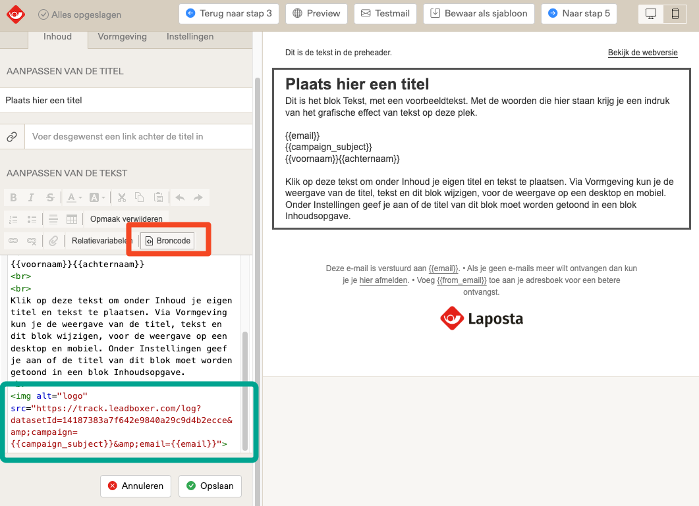
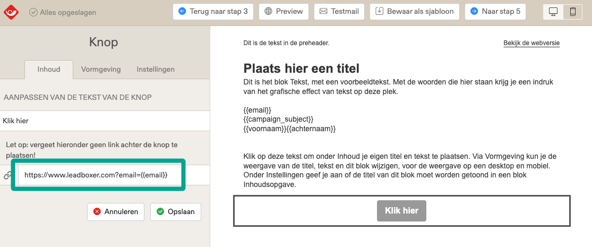

# LaPosta

### Identify & track LaPosta email recipients on your website&#x20;

#### Step 1: Track email opens

To track mail open/reads from your LaPosta audience in LeadBoxer, you need to add a LeadBoxer tracking pixel to your campaigns or templates.&#x20;

Follow these steps for adding the tracking pixel:

1. Go to your campaign or templates ('sjablonen')
2. Choose the mail or template you want to track
3. Design the email using the Drag & Drop builder.&#x20;
4.  Choose or add a textblock at the bottom of the email and switch to 'Broncode' (code view)\


    <figure><figcaption></figcaption></figure>
5. Paste your email tracking pixel into the bottom of the HTML, it should look something like this:


```html

```


5. Save

<mark style="color:orange;">**Important Notes:**</mark>

* Don't forget to change the DATASET ID to your own.&#x20;
* You can add additional data fields variables as parameters by simply adding these to the pixel, eg \&companyName=\{{company\}}
* For more details on advanced data fields in LaPosta see: \
  [https://docs.laposta.nl/article/273-hoe-personaliseer-ik-mijn-nieuwsbrief](https://docs.laposta.nl/article/273-hoe-personaliseer-ik-mijn-nieuwsbrief)

### Step 2: Track email clicks (click-thrus) and identify prospects on your site

To track email clicks, you need to modify the link(s) inside your email campaigns and add this parameter to the URL of each link:

**\&email=\{{email\}}**

<figure><figcaption></figcaption></figure>

This will allow us to identify actual individual visitors when they land on your site.


Optional, but recommended; add additional parameters to enrich visitors with information from your database:

**example URL**


```url
https://www.YOURDOMAINNAME.com/my-landing-page/?firstName={{voornaam}}&lastName={{achternaam}}&email={{email}}
```


Important NOTE: remember to update the "YOURDOMAINNAME" landing page URL from above example with your url.

\
Tip: Best practice is to test before sending out a mass email.
