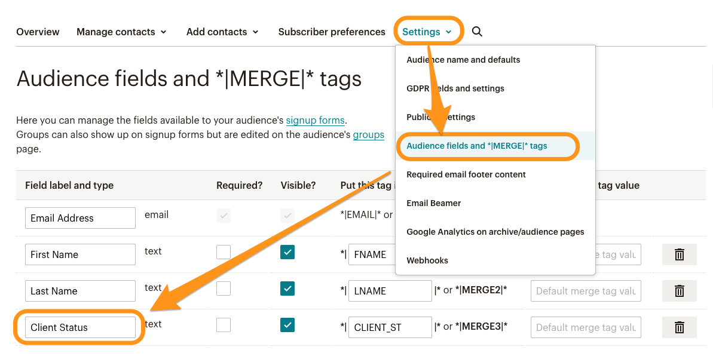

# Mailchimp

## **See all Mailchimp activity in LeadBoxer**

The LeadBoxer Mailchimp Integration automatically pulls all activity from your Mailchimp account into LeadBoxer. This means that all recipients who either a) read your emails or b) click on a link, will be created or updated in LeadBoxer.&#x20;

These leads will also be enriched and scored. This means that using Segments and Notifications you can automatically find out who is interested in what, and if they are Ready-to-Buy.


NOTE: Step 2 is VERY IMPORTANT as this will allow us to combine measurement of email opens and website activity in order to identify Buyer Intent.


### Setup Instructions

### **Step 1: Enable the integration**

Go to the Mailchimp integrations page in your LeadBoxer account, and click **New Integration**\


<figure><figcaption></figcaption></figure>

\
You will then be redirected to Mailchimp where you will need to authorise access by providing your Mailchimp (admin) credentials.

<figure><figcaption></figcaption></figure>

On successful authentication, you are automatically returned to the integrations page, where you need to select the dataset (website) that you want to connect to your MailChimp account.&#x20;

Don't forget to SAVE.

### What happens next?

LeadBoxer will now start pulling in the data going forward.\
NOTE: We will only use this to pull / retrieve (read) the behavior of your Mailchimp audience.\
NOTE: if you have or login to multiple Mailchimp accounts - please be sure that you are configuring the CORRECT Mailchimp account. In other words - you need to associate the right Mailchimp account to the right dataset in LeadBoxer.

### Step 2: Use Mailchimp to identify website visitors.

LeadBoxer will be able to identify any person who (a) clicked through from the newsletter and (b) lands on your website. This is accomplished by  modifying the links in your Mailchimp emails.

It involves a small change to your normal workflow:

Create your mail campaign like you always do, and make sure you add links to a landing page on your site.&#x20;

Once your email is ready, all you need to do is edit the existing links that point to your website. Add the following parameters to the URL that links to your site:

```url
?lb_src=mc_*|LIST:UID|*&lb_eid=*|UNIQID|*
```

These parameters are called [merge tags](http://mailchimp.com/features/merge-tags/) and will append the links from the email to your site, so that we can identify the actual person on your website.


(1) Once you have edited the links, (2) save your newsletter, and (3) test the links by hovering or clicking on them in the preview (enable merge tags in your preview). You should see the user ID and other fields appended to the url on your landing page:&#x20;

<figure><figcaption></figcaption></figure>

**You're Ready to Roll!**

Now send out your campaign and see the magic happen in LeadBoxer.

### **Get more marketing data: Campaign name and Source**

The easiest way to accomplish this is to enable Google Analytics tracking in MailChimp.\
Instructions are located here:\
[https://kb.mailchimp.com/integrations/google-analytics/integrate-google-analytics-with-mailchimp](https://kb.mailchimp.com/integrations/google-analytics/integrate-google-analytics-with-mailchimp)

Moving forwards LeadBoxer will take over and add the data to each lead. Obviously the LeadBoxer pixel needs to be installed on the landing pages.&#x20;

It's always a good idea to test this thoroughly before sending to your main lists. If things are working, you'll see the emails of leads interested in your newsletter's landing page.

### Custom fields

We can also capture additional (custom) fields you might have defined, for example to indicate if a contact is a (former) client or any other (merge) field you might have.

#### Example

A usefull example would be a field called **Client Status.** If you can indicate in Mailchimp contacts are currently a client, a former client, etc. We can then capture this and add this as a custom field in LeadBoxer. This will allow you to easily filter IN or OUT these contacts based on this field.

<figure><figcaption></figcaption></figure>

Simply contact support and let us know which field(s) names you would would like us to capture, in the above example the field would be 'Client Status'


> [!NOTE]  
> Highlights information that users should take into account, even when skimming.

> [!TIP]
> Optional information to help a user be more successful.

> [!IMPORTANT]  
> Crucial information necessary for users to succeed.

> [!WARNING]  
> Critical content demanding immediate user attention due to potential risks.

> [!CAUTION]
> Negative potential consequences of an action
