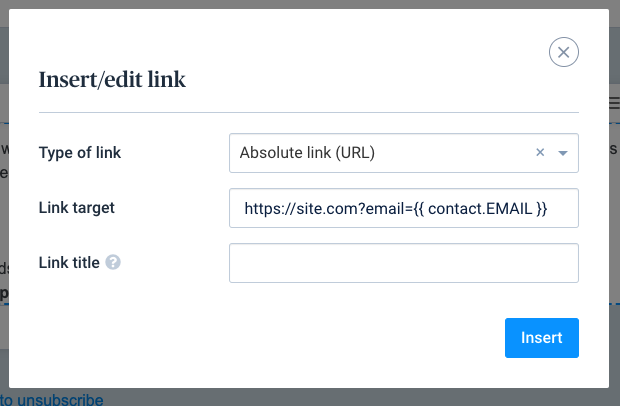

# Sendinblue

This tutorial tells you how to use leadBoxer email tracking for individuals originating from your Sendiblue emails.

Leadboxer will show you the email and website behaviour of the person who opened and clicked through the links in your email, simply by adding a special link in the emails sent and adding code to the landing page.

Technical requirements:

1. LeadBoxer account
2. Sendiblue account

Steps:

1. Customize the links in your email newsletter
2. Install the email tracking pixel

Assuming you fulfilled both requirements, let's proceed to step 1.

### Step 1

Capturing data from your email readers involves a small change to your normal workflow.

Create your emails like you always do, and modify all the links that go to the pages of your website. If our tracking code is on these pages, it will automatically capture the information being sent from the Sendiblue email once they click a link.

When your email is ready, add dynamic fields to your links as parameters.

<figure><figcaption></figcaption></figure>

Here is the minimal version of what you need to add:

```
?email={{ contact.EMAIL }}
```

This will append the email address to the url of the landing page. You can do this for all fields available in mailup eg:

```
?email={{ contact.EMAIL }}&firstName={{ contact.FIRSTNAME }}&lastName={{ contact.LASTNAME }}
```

Save your email, and test the links by sending yourself a copy, you should see the email address and other fields appended to the url on your landing page. The following image shows what you should see appended to the url of your landing page:

<figure><figcaption></figcaption></figure>

### Step 2

Next, you will need to add the LeadBoxer email tracking pixel so that we can also track email opens and get information on how often customers read your emails.

In the Editor, use the HTML content block to add the tracking pixel. Place this block at the bottom of your email content.

We recommend to compose the pixel in a text-file before using pasting it in the actual email.

You can use below snippet as starting point. Make sure to replace the DatasetID with your own and if needed, update the campaign value with the correct campaign name.


```html

```


<figure><figcaption></figcaption></figure>

It's always a good idea to test this thoroughly before sending this to you main lists. If things are working, you'll see the emails of leads interested in your newsletter's landing page.

For more documentation, you can read:

[https://help.sendinblue.com/hc/en-us/articles/360001008200-Customize-your-emails-using-contact-attributes](https://help.sendinblue.com/hc/en-us/articles/360001008200-Customize-your-emails-using-contact-attributes)
