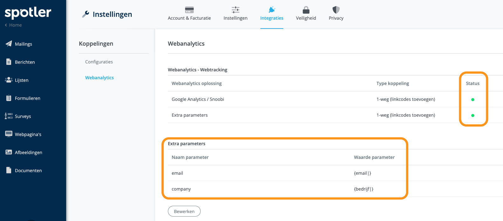
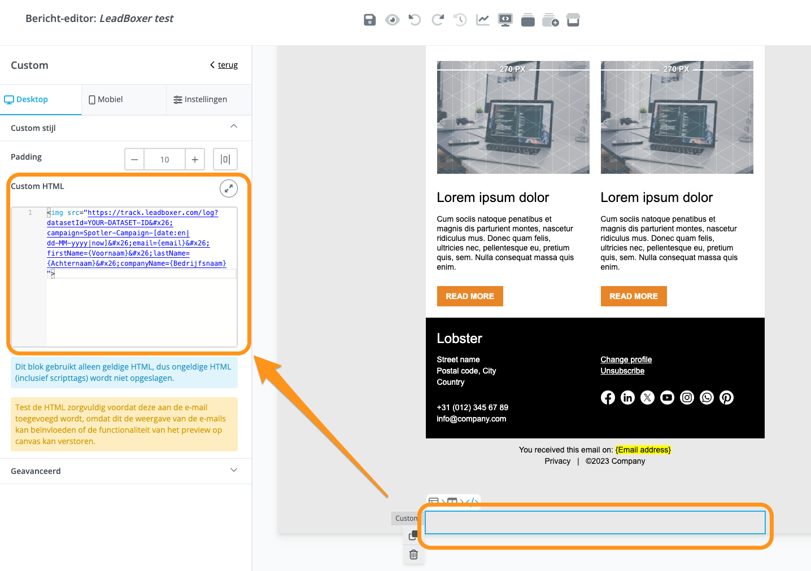

# Spotler

### 1. Track Spotler Email opens or reads:

To track mail open/reads, add a new block switch to the HTML/code view in there you need to add:


```html

```



Make sure you change datasetId and campaign name in above snippet.

Unfortunatly, Spotler does not have the option to dynamically use the title of the email in the campaign variable, meaning you will need to either use a generic campaign name or manually change this for each email that is send out.


### 2. Tracking Spotler clicks

First we recommend you enable the Google Analytics integration, so that UTM tags are added to all the URLs

Secondly, you can to add identification parameters to every URL. This can be accomplished by using 'Extra parameters' feature. We recommend to add email and company parameters.

<figure><figcaption></figcaption></figure>

Even though it looks like it is enabled for for all emails like this, we found It might be necessary to manually enable this again in the emails/ newsletters themselves.

&#x20;Click on the Analytics button at the top of the email

<figure><figcaption></figcaption></figure>

<figure><figcaption></figcaption></figure>

The Extra parameters feature only allows for 2 additional parameters, so if you need more you can still manually add them like this:


```url
https://www.leadboxer.com?firstName={vNaam}&lastName={aNaam}&email={email}&companyName={bedrijf}
```


