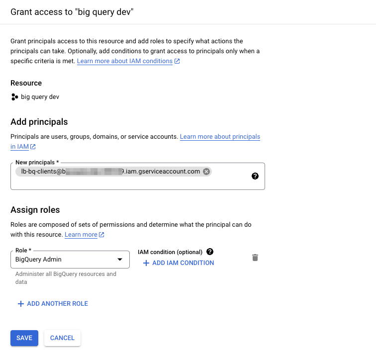

# Google Big Query

### Prerequisites 

1. A valid Google Cloud Platform (GCP) account.
2. Google Cloud billing is enabled, and current
3. Proper permissions to create service accounts and assign roles in the Google Cloud IAM & Admin console.

### Step 1: Choose your Google Cloud Project 

1\. Sign in to your Google account.

2\. Go to [Google Cloud Console](https://console.cloud.google.com/).

3\. If prompted, select or create a new project from the project drop-down menu in the top navigation bar. This project will be used for your BigQuery setup.

### Step 2: Enable the BigQuery API 

1\. Ensure you have selected the correct project from the project drop-down menu in the top navigation bar.

2\. To enable the BigQuery API, click on the following link: [Enable BigQuery API](https://console.developers.google.com/apis/library/bigquery-json.googleapis.com/).

### Step 3: Granting Permissions to the LeadBoxer Service Account 

1. In the Google Cloud Console, by clicking on the hamburger menu (☰) navigate to "IAM & admin" and click "IAM" from the left menu.
2. Click on the "Grant Access" button to grant permissions to our Service Account.
3. Paste the Service Account ID we have provided into the "New principals" field.
4.  In the "Assign Role" field, select (or search for) "BigQuery Admin" from the dropdown menu.\

    <figure><figcaption></figcaption></figure>
5. Click "Save" to grant the necessary permissions to your Service Account.

### Step 5: Check Google Cloud Billing 

1. Go to "Billing" in the Google Cloud Console by clicking on the hamburger menu (☰) in the top-left corner, then selecting "Billing" from the menu.
2. Ensure that billing is active and configured for your project. If it's not, follow the prompts to enable billing.

Congratulations! You have successfully configured our Service Account to access BigQuery.&#x20;
