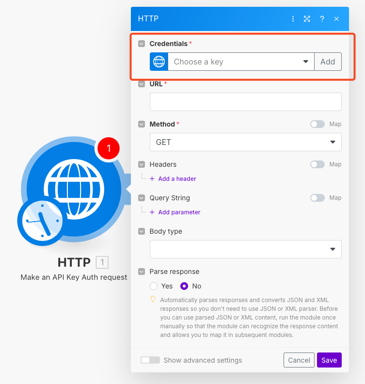
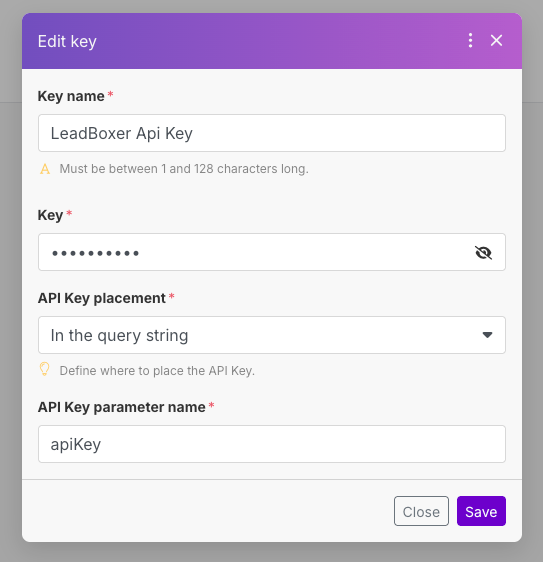
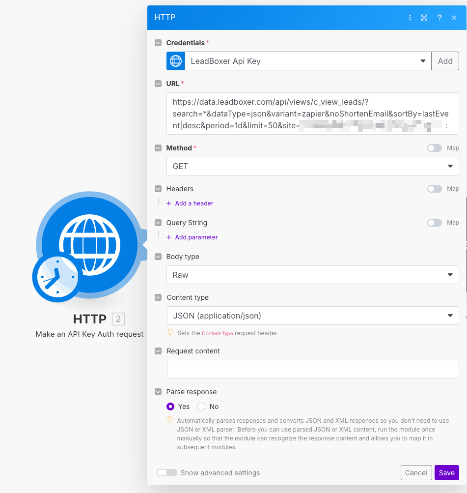
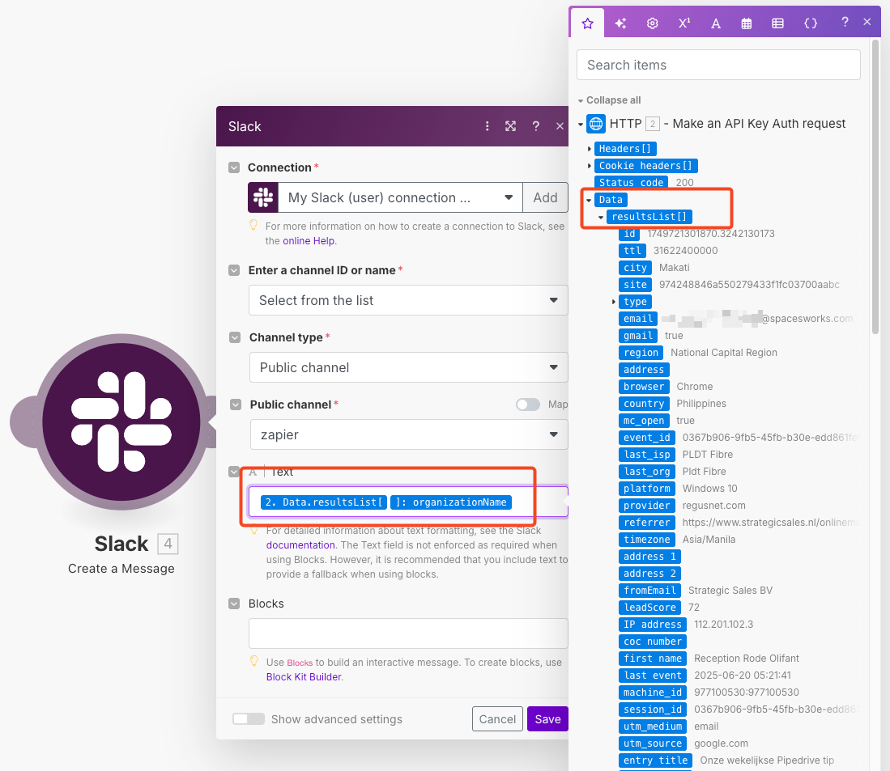

# make.com

Step 1

Add the HTTP module > **Make an API Key Auth request**

<figure><figcaption></figcaption></figure>

Step 2&#x20;

Add new credentials

<figure><figcaption></figcaption></figure>

First you need to get your API key inside the LeadBoxer App from integrations > data\
[https://app.leadboxer.com/integrations-connectors/data/api-key](https://app.leadboxer.com/integrations-connectors/data/api-key)

Give the key a name, paste the LeadBoxer API key, set the placement to 'in query string' and the parameter name to **apiKey**

<figure><figcaption></figcaption></figure>

Step 3

in the HTTP module settings:

* select the new API key in the credentials.
* URL:  <mark style="color:blue;">https://data.leadboxer.com/api/views/c\_view\_leads/?search=\*\&dataType=json\&variant=zapier\&noShortenEmail\&sortBy=lastEvent|desc\&period=1d\&limit=50\&site=#### YOUR DATASET ID ###</mark>
* Body type: Raw
* Content type: JSON
* Parse response: yes
* save

<figure><figcaption></figcaption></figure>

step 4

You can now add other modules to your scenario and access data from LeadBoxer, you can see the data under the 'ResultsList

Here is an example using Slack, adding identified companies to a slack channel

<figure><figcaption></figcaption></figure>

Make sure to use the fields that start with organization\*
