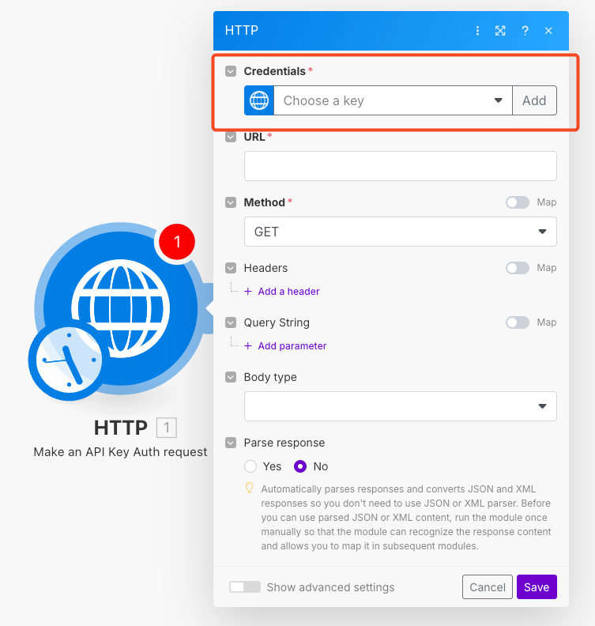
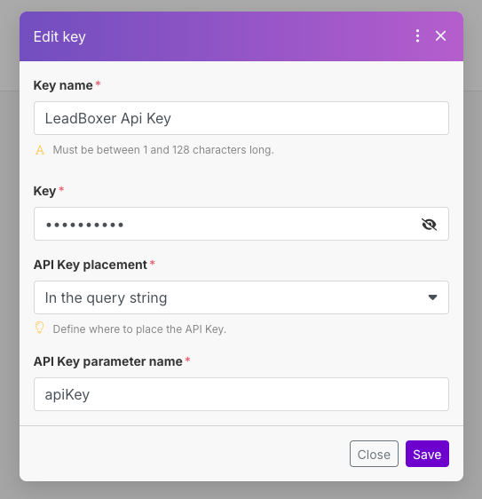
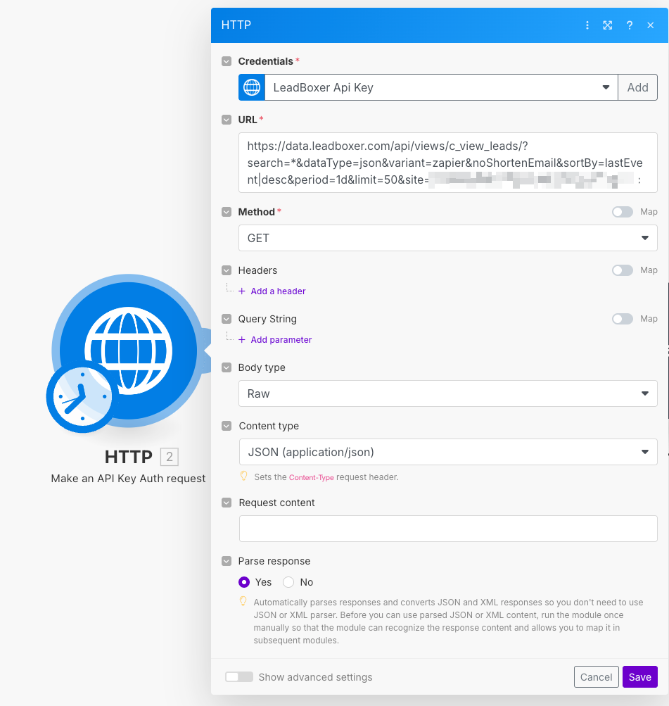
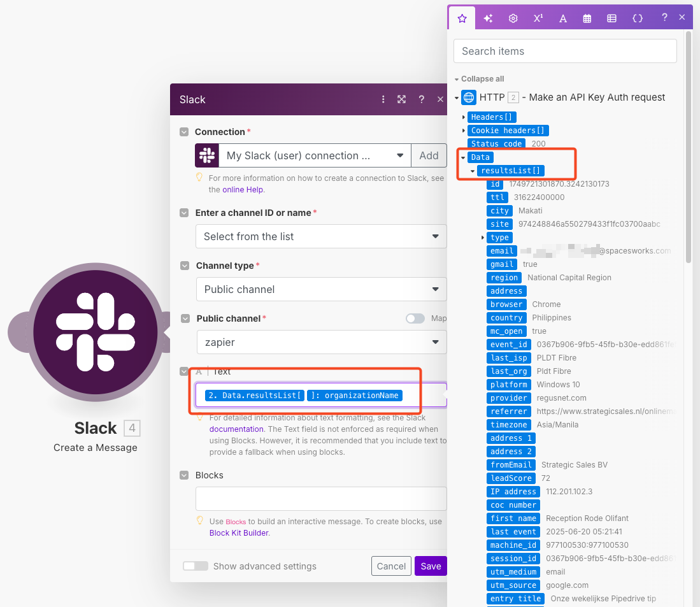

# make.com

This guide shows how to pull your LeadBoxer App leads into a Make scenario. For API-first automations, see [n8n and Make automation](https://www.leadboxer.com/integrations/automation) and the [Make guide on the developer portal](https://developers.leadboxer.com/docs/make).

Step 1

Add the HTTP module > **Make an API Key Auth request**

<figure><figcaption></figcaption></figure>

Step 2&#x20;

Add new credentials

<figure><figcaption></figcaption></figure>

First you need to get your API key inside the LeadBoxer App from integrations > data\
[https://app.leadboxer.com/integrations-connectors/data/api-key](https://app.leadboxer.com/integrations-connectors/data/api-key)

Give the key a name, paste the LeadBoxer API key, set the placement to **in the header** and the parameter name to **x-api-key**.


The screenshots show an older setup with the key in the query string. The public API expects the key in the `x-api-key` header.


<figure><figcaption></figcaption></figure>

Step 3

in the HTTP module settings:

* select the new API key in the credentials.
* URL:  `https://api.leadboxer.com/v1/leads?site=YOUR_DATASET_ID&timeField=eventEsTimestamp&criteriaTimeFilter=eventEsTimestamp%7Cexactly%7C0&criteriaDisplayFilter=company&sortBy=lastEvent%7Cdesc&limit=50`

  This returns up to 50 identified companies seen today, newest first. Replace `YOUR_DATASET_ID` with your dataset ID. To change the period use for example `criteriaTimeFilter=eventEsTimestamp%7Clessthan%7C6` (last 7 days); `%7C` is the `|` character, which must be URL-encoded. All parameters are described in the [API reference](https://developers.leadboxer.com) under Retrieve Leads.
* Body type: Raw
* Content type: JSON
* Parse response: yes
* save

<figure><figcaption></figcaption></figure>

step 4

You can now add other modules to your scenario and access data from LeadBoxer, you can see each lead under `data` in the response

Here is an example using Slack, adding identified companies to a slack channel

<figure><figcaption></figcaption></figure>

Make sure to use the fields that start with organisation\*
