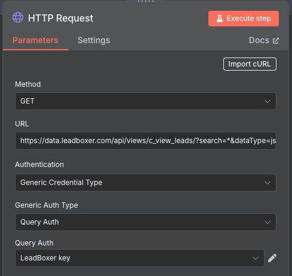
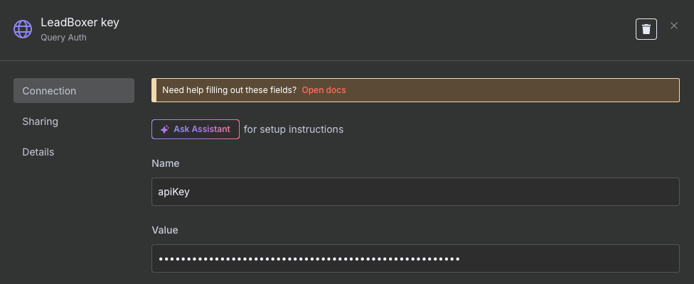
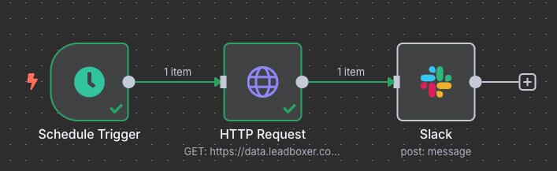
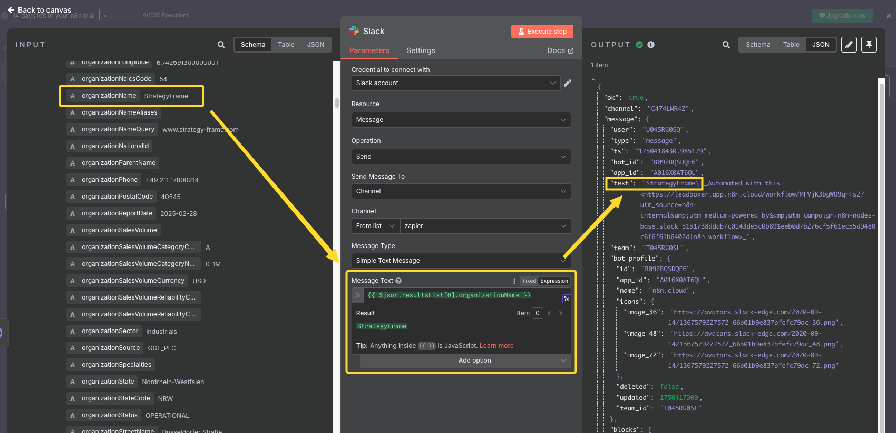

# n8n


Only need company details for a domain or IP address? Install the LeadBoxer community node instead: in n8n go to **Settings > Community Nodes**, select **Install** and enter `n8n-nodes-leadboxer`. It adds Domain Lookup and IP Address Lookup operations. The steps below pull your leads with the HTTP Request node.


Step 1

Add a scheduled Trigger, to query the LeadBoxer API for fresh results. We recommend to set this to every 10 minutes or so, depending on your traffic volumes.

Step 2

Add the HTTP Request node

Step 3

in the HTTP node settings:

* Method = GET
* URL:  `https://api.leadboxer.com/v1/leads?site=YOUR_DATASET_ID&timeField=eventEsTimestamp&criteriaTimeFilter=eventEsTimestamp%7Cexactly%7C0&criteriaDisplayFilter=company&sortBy=lastEvent%7Cdesc&limit=50`

  This returns up to 50 identified companies seen today, newest first. Replace `YOUR_DATASET_ID` with your dataset ID. To change the period use for example `criteriaTimeFilter=eventEsTimestamp%7Clessthan%7C6` (last 7 days); `%7C` is the `|` character, which must be URL-encoded. All parameters are described in the [API reference](https://developers.leadboxer.com) under Retrieve Leads.
*

    
<figure><figcaption></figcaption></figure>

* Set authentication

First you need to get your API key inside the LeadBoxer App from integrations > data\
[https://app.leadboxer.com/integrations-connectors/data/api-key](https://app.leadboxer.com/integrations-connectors/data/api-key)

Give the key a name, paste the LeadBoxer API key, set the placement to **in the header** and the parameter name to **x-api-key**.


The screenshots show an older setup with the key in the query string. The public API expects the key in the `x-api-key` header.


<figure><figcaption></figcaption></figure>

step 4

You can now add other nodes to your canvas and access data from LeadBoxer, you can see the data in output

Here is an example using Slack, adding identified companies to a slack channel

<figure><figcaption></figcaption></figure>

<figure><figcaption></figcaption></figure>

Make sure to use the fields that start with organization\*
