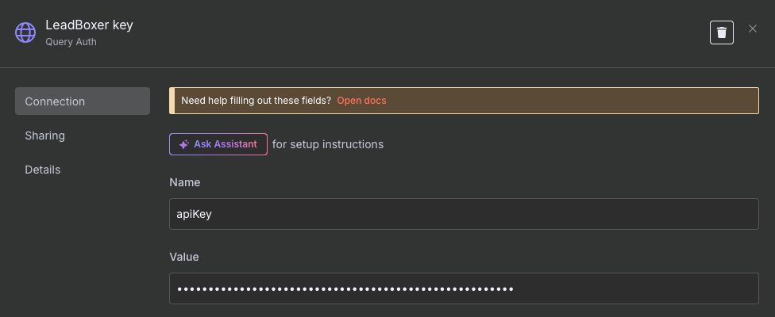

# n8n

Step 1

Add a scheduled Trigger, to query the LeadBoxer API for fresh results. We recommend to set this to every 10 minutes or so, depending on your traffic volumes.

Step 2

Add the HTTP Request node

Step 3

in the HTTP node settings:

* Methode = GET
* URL:  <mark style="color:blue;">https://data.leadboxer.com/api/views/c\_view\_leads/?search=\*\&dataType=json\&variant=zapier\&noShortenEmail\&sortBy=lastEvent|desc\&period=1d\&limit=50\&site=#### YOUR DATASET ID ###</mark>
*

    
<figure><figcaption></figcaption></figure>

* Set authentication

First you need to get your API key inside the LeadBoxer App from integrations > data\
[https://app.leadboxer.com/integrations-connectors/data/api-key](https://app.leadboxer.com/integrations-connectors/data/api-key)

Give the key a name, paste the LeadBoxer API key, set the placement to 'in query string' and the parameter name to **apiKey**

<figure><figcaption></figcaption></figure>

step 4

You can now add other nodes to your canvas and access data from LeadBoxer, you can see the data in output

Here is an example using Slack, adding identified companies to a slack channel

<figure><figcaption></figcaption></figure>

<figure><figcaption></figcaption></figure>

Make sure to use the fields that start with organization\*
