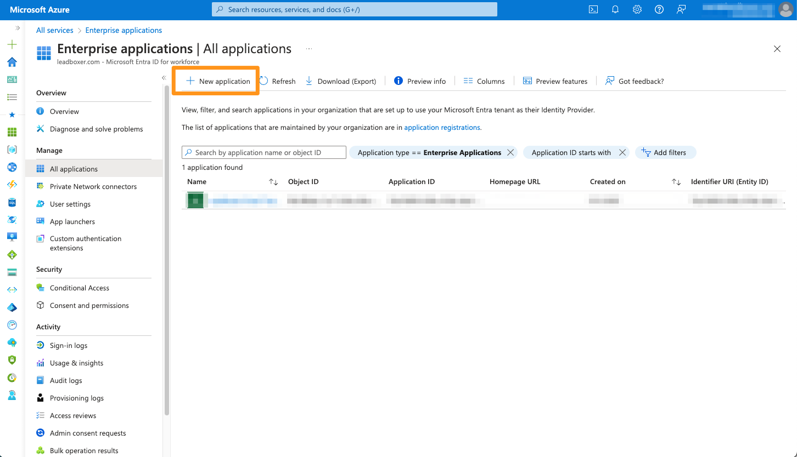
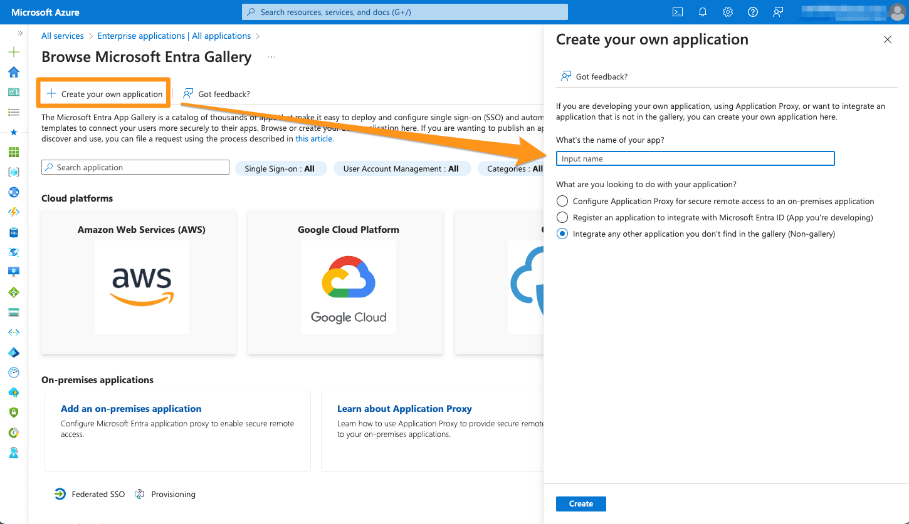
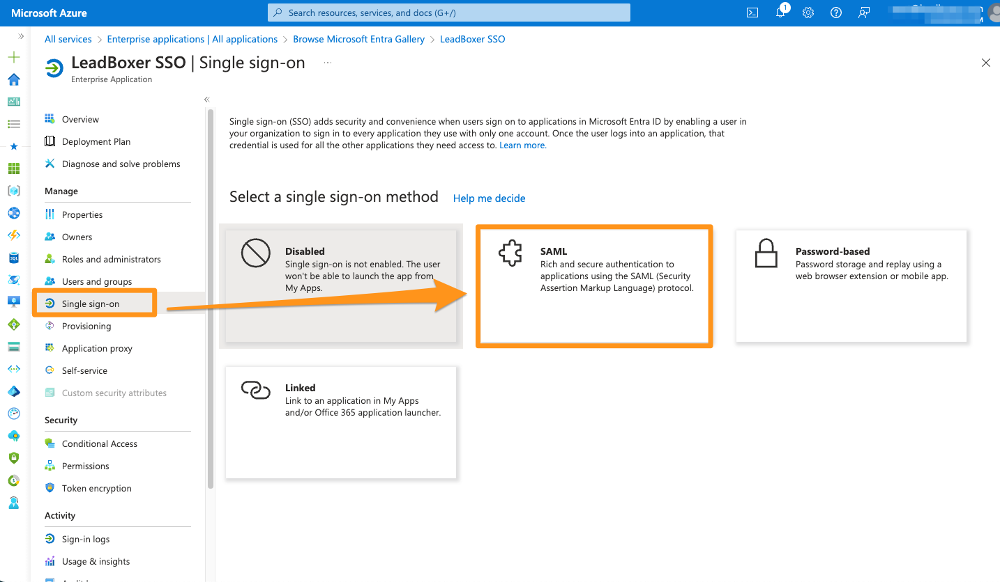

# Single Sign On (SSO)

### Prerequisites 

1. A LeadBoxer Enterprise account
2.  A valid SSO service.&#x20;

    At the moment we support Microsoft Entra ID (previously Azure Active Directory)\
    contact us if you need us to support other SSO providers
3. All users that you want to provide LeadBoxer access through SSO also need to be present in LeadBoxer as users.

## Microsoft Entra ID setup  

1. Log into your Azure Portal
2. Go to Enterprise Applications

<figure><figcaption></figcaption></figure>

3. Create a new Application

<figure><figcaption></figcaption></figure>

4. Provide a name, eg: LeadBoxer SSO\
   and set "Integrate any other application you don't find in the gallery (Non-gallery)"

<figure><figcaption></figcaption></figure>

5. Once the application is created,\
   Proceed to the "Single sign-on" option.\
   Select "SAML" as the authentication method.

<figure><figcaption></figcaption></figure>

6.  On the next screen, edit the Basic SAML configuration, and set the following URLs:

    \
    Identifier (Entity ID):

    `https://lbapiv2/saml2/service-provider-metadata/adfs`

    \
    Reply URL (Assertion Consumer Service URL):

    `https://lb1.leadboxer.com/login/saml2/sso/adfs`\

    <figure><figcaption></figcaption></figure>
7.  The last step is to copy and share with us the "App Federation Metadata Url" located under the "SAML Certificates" section.

    <figure><figcaption></figcaption></figure>
8. Once we have received the App Federation Metadata Url from you, we will add it to our settings and confirm.&#x20;

## Login

Once confirmed  your users can log into LeadBoxer using their SSO Account.

<figure><figcaption></figcaption></figure>

## Microsoft Entra ID login 

1.  Use the Login with Microsoft button

    <figure><figcaption></figcaption></figure>
2. Login and /or authenticate with your Microsoft account
3. Once authenticated you will get redirected to the application


Any user that you want to provide LeadBoxer access through SSO also need to be present in LeadBoxer as a user.


