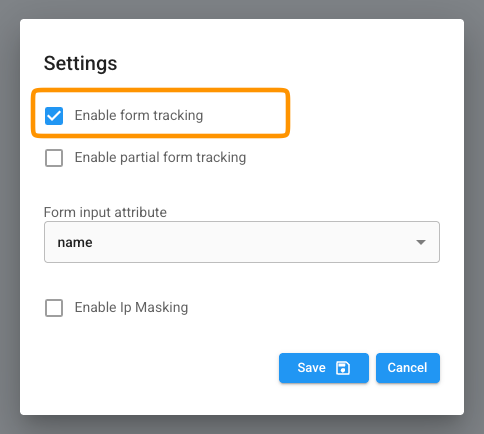
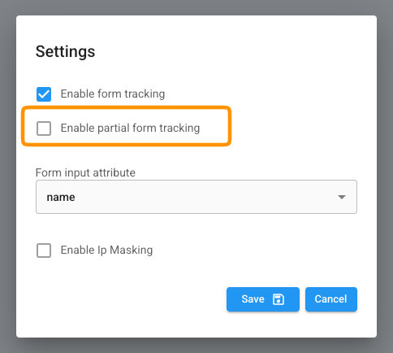

# Automatic form tracking

Amazingly easy: Automatically identify your visitors / leads when they fill in a form.

### Description

Automatic Form tracking can be easily enabled. This will allow us to auto-magically capture and track Contact details submitted by ANY form.

Additionally, if you build the form-fields to match the [placeholder names](../../fundamentals/elements/import-and-export/leadboxer-user-interface-placeholder-names.md) we use, we will populate the Leads in our LeadBoxer reporting interface with the data fields submitted by your visitors and leads. Alternatively, you can send you own custom data to LeadBoxer, which will then appear under Lead Properties on your Lead.

### Instructions

1. Log into your LeadBoxer account as an Admin
2.  Go to your datasets menu / overview \[[https://app.leadboxer.com/datasets\]](https://app.leadboxer.com/datasets]) and click the gear icon for the dataset you want to enable it for

    <div align="left"></div>
3. Select settings: this should show a modal in where you can enable or disable the auto form tracking feature
4.  Enable the auto form tracking and save

    <div align="left"><figure><figcaption></figcaption></figure></div>
5. Choose if you want us to monitor the fieldnames based on ID or name element.
6. **Important**: Test your forms thoroughly, especially if you have complicated or custom-built forms.

#### Result

When you implement the code, your data will appear on your Leads.&#x20;

### Implementation notes

* By default, the field names that are automatically captured are taken from the 'name' of the form element
* The form submit button needs to be type='submit'


***

## Partial Form Tracking

Partial Form Tracking allows LeadBoxer to capture lead information from forms, even when visitors do not complete or submit the form.

Once enabled, LeadBoxer will monitor supported forms on pages where the LeadBoxer tracking script is installed.

### How to enable Partial Form Tracking

You can enable Partial Form Tracking per dataset in the dataset settings panel.

Simply open your dataset settings and enable the Partial Form Tracking option.

<div align="left"><figure><figcaption></figcaption></figure></div>

### How it works

When enabled, LeadBoxer will start monitoring forms on your website and temporarily collect supported field values while visitors interact with the form.

By default, LeadBoxer only monitors the following fields:

* First name
* Last name
* Email address

If you would like to monitor additional fields, please contact our support team.

### Processing logic

Form data is temporarily stored while the visitor is filling out the form.

**If the form is submitted**

When a visitor successfully submits the form, the temporary data is ignored and the final submitted form data is used instead.

**If the form is abandoned**

If the visitor leaves the form without submitting it, LeadBoxer will process the temporarily stored data after 5 minutes of inactivity and add it to the visitor profile.

**Late form submissions**

If a visitor submits the form after the 5 minute inactivity window, the final submitted form data will automatically overwrite the previously stored temporary data.

#### Important notes

* Partial Form Tracking only works on pages where the LeadBoxer tracking script is installed.
* Tracking behavior may depend on your site’s consent and privacy settings.
* We recommend reviewing your privacy policy before enabling this feature.

## Optional improvements

If the field names that you want to capture are not properly defined, we recommend you alter them in your forms.

Adjust your form fields to match our pre-defined properties, for full integration in our app interface. These are the [placeholder names](../../fundamentals/elements/import-and-export/leadboxer-user-interface-placeholder-names.md) we use.

## Example Form


```html
<!DOCTYPE html>
<html lang="en">
<head>
<meta charset="utf-8">
<title>Example of Automatic Form Tracking - Example</title>
<!-- LEADBOXER START -->
<script type="text/javascript"
defer="defer" src="//script.leadboxer.com/?dataset=YourDataSetID&form"></script>
<!-- LEADBOXER END -->
</head>
<body>
<form name="myform" method="post" action="">
<label>email:</label>
<input name="email" type="email" id="email" value="" />
<label>
company:
</label>
<input name="companyName" type="text" id="companyName" />
<label>
first name:
</label>
<input name="firstName" type="text" id="firstName" />
<label>
last name:
</label>
<input name="lastName" type="text" id="lastName" />
<label>
phone number:
</label>
<input name="phoneNumber" type="text" id="phoneNumber" />
<input type="submit" name="submitForm" id="submitForm" value="Click to Submit" />
</form>
</body>
</html>
```


Here is this [Example](http://api.leadboxer.com/api/examples/forms/index-script.html)

## Full control

If you prefer full control over the data that is being captured and submitted, you can try using manual form tracking. See the next page.
