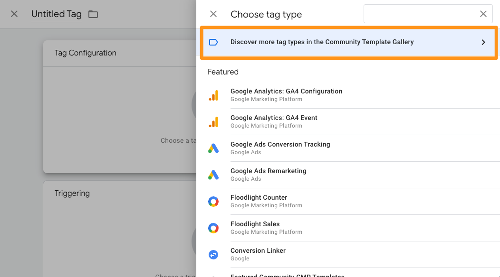
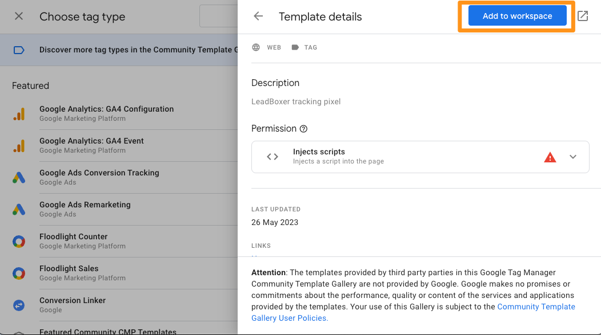
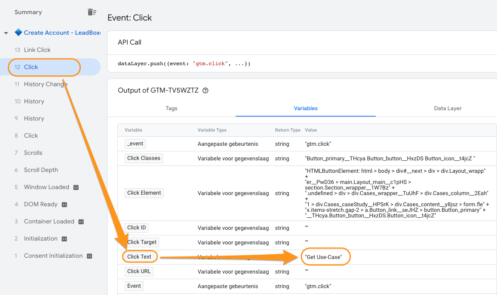

# Google Tag Manager (GTM)

### How to place the Lead Tracking Pixel in your website using Google Tag Manager (GTM)

[](https://fast.wistia.net/embed/iframe/t0801ta53m)


### Step by step guide

Here are the basic steps needed to publish the Lead Pixel in your website and start converting anonymous traffic into leads.

Steps:

1. Login to your Google Tag Manager and access your container
2. To add the Lead Pixel, click on ‘add new tag’&#x20;
3.  For Tag type, choose: Discover more tag types


    <figure><figcaption></figcaption></figure>


4.  Search for LeadBoxer


    <figure><figcaption></figcaption></figure>


5.  Add the LeadBoxer pixel tag to your workspace


    <figure><figcaption></figcaption></figure>


6.  Cut & paste your dataset ID. You can find your dataset ID [datasets overview page](https://app.leadboxer.com/datasets). Also give your tag a clear name.


    <figure><figcaption><p>Add code to Tag</p></figcaption></figure>


7.  Next you need to select or create your Trigger. We recommend to set it on all pageviews.


    <figure><figcaption><p>Trigger on all pageviews</p></figcaption></figure>


8.  Save the trigger and the tag


    <figure><figcaption></figcaption></figure>


9. Don't forget to Submit (publish) your changes - you’re done, you now have the basic Lead Pixel (javascript) working.

## Events

If you want to track on-page events using the Google Tag manager, you can follow these instructions.

### Simple events

If you would like to send a simple signal for any on-page event. for example when a lead expands a section on your site, you can use the sendEvent function that is build into the LeadBoxer tag.

Simply add a new Tag like this

```javascript
<script type="text/javascript"> 
   OTLogService.sendEvent("My simple event name"); 
</script>
```

And connect this to any trigger


### Advanced event tracking

1. Make sure the LeadBoxer pixel (script tag) is loaded on the initial pageview.
2.  First you need to define a new variable to grab the page title (for some reason GTM does not provide this variable by default so we need to define it ourselves)\
    In your Google Tag Manager container, go to Variables > Javascript Variable and enter 


    ```javascript
    document.title
    ```
    .png)
3.  Create and send a new event that triggers on every Custom Event.


    ```javascript
    <script type="text/javascript">    
    	var map = new OTMap();    
    	map.put("lc", {{Page URL}});    
    	OTLogService.sendEvent("{{Javascript - Page Title}}", map); 
    </script>
    ```
    .png)
4. Now connect this tag to any trigger you want: events, clicks, buttons, downloads, etc.
5. Don't forget to publish and you should be set.


### Complete Example: how to track a button click

1.  **In GTM, enable built-in Click Variables**\
    To be a able to trigger based on a click you need to enable these specific click variables. \
    Variables are little pieces of information that can be used both in Tags and Triggers. For example, **Click ID**. You can use it as a trigger condition (e.g. _fire the LeadBoxer Event code **when** the ID of the clicked link equals to “main-cta-link”_).

    <figure><figcaption></figcaption></figure>
2.  **In GTM tag assistant, Find the variable values to trigger on**\
    Go to preview mode and on your site, click on the button you want to track. Switch to the assistant mode and you should see the button click listed in your behaviour.\
    Select this click and find the right variable. (in our case the button text works, but you might want to use ID, class, URL or any of the above variables.) \
    Copy the variable value.


    <figure><figcaption></figcaption></figure>
3.  **in GTM, enable a link click trigger** \
    In order to enable link click tracking, we need to enable a thing called link click listener (a.k.a. link click auto-event listener). It’s a feature in GTM that listens to link clicks on a page. If it spots one, it will display that event in the GTM Preview and Debug (P\&D) mode, and we’ll be able to use it as a condition to fire tags. \
    In Google Tag Manager, go to Triggers > Trigger Configuration > New > Click - All elements. Set the trigger to only to fire on some Clicks and choose your variable from step 2.


    <figure><figcaption></figcaption></figure>


4.  **Create a LeadBoxer Event tag to fire on this trigger**\
    Create a new tag, and add this javascript to send the custom event to LeadBoxer


    ```javascript
    <script type="text/javascript">    
    	var map = new OTMap();    
    	map.put("lc", {{Page URL}});    
    	OTLogService.sendEvent("Case study submit click", map); 
    </script>
    ```


    <figure><figcaption></figcaption></figure>


5. Don't forget to connect the tag from step 4 to the trigger from step 3 and also to publish the changes.


## Google Tag Manager Data Layer Integration

If you would like to use data from your Data Layer and push it to LeadBoxer, you can do so by implementing the LeadBoxer onload function.

Here is an example snippet of javascript:

```javascript
// setup the onload function
function ot_onload() {

  // find the tag manager container ID
  var tag = window.google_tag_manager
  var containerId;
  for (var key in tag) {
    if (key.startsWith("GTM")) {
      containerId = key;
      break;
    }
  }

  // next, set the variables you want to get from your data layer
  var primaryCategory = window.google_tag_manager[containerId].dataLayer.get("primaryCategory");
  var primaryCategoryList = window.google_tag_manager[containerId].dataLayer.get("primaryCategoryList");

  // put the values in a map     
  _otmap.put("primaryCategory", primaryCategory);
  _otmap.put("primaryCategoryList", primaryCategoryList);     
     
  // expose the variables for collection
  ot_log_state();
```

Above example allows you to get data from the Google Tag Manager Data Layer, and submit this to LeadBoxer,

**Important**:\
Now the only requirement is that this function needs to load **before** the default tracking javascript (aka LeadPixel)
